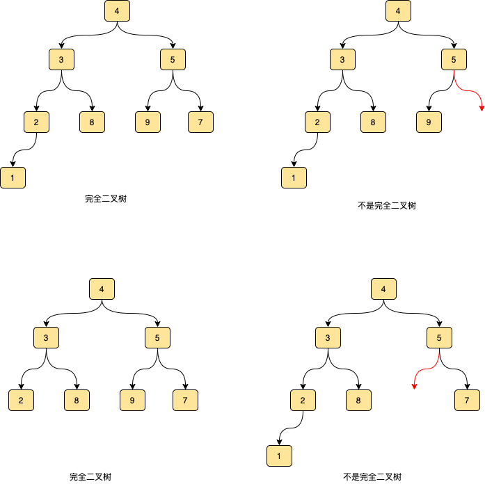
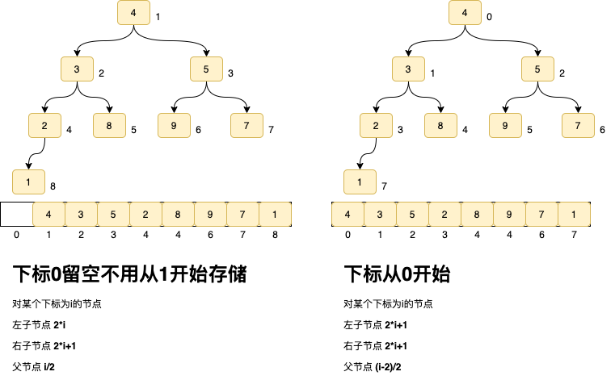
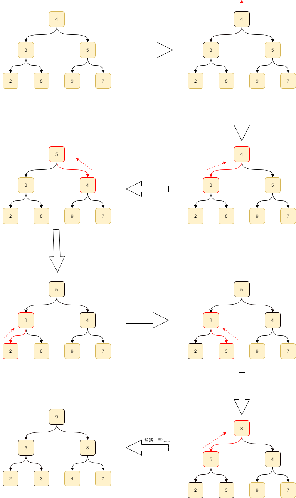
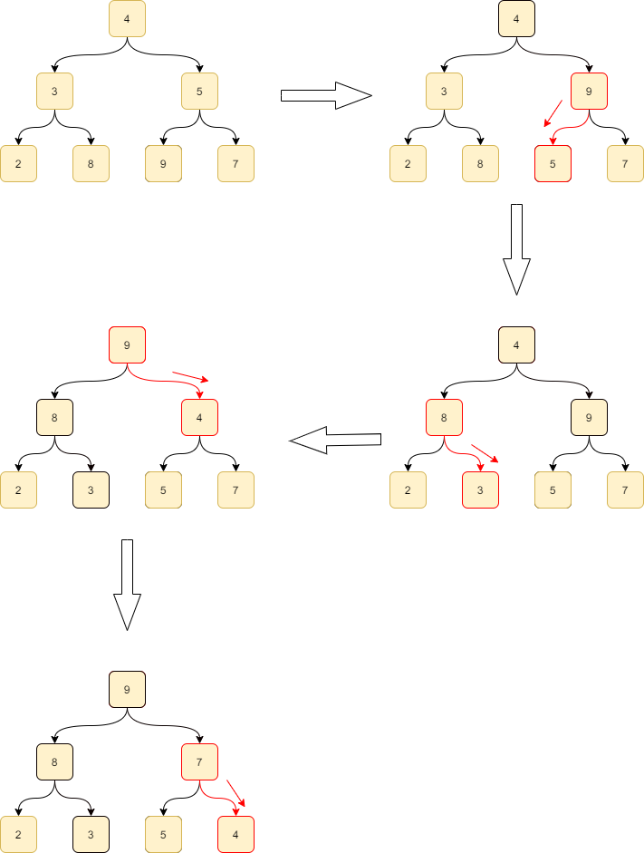

# 解决TopK

## 前言

TopK问题有以下几种常见形式
> 1. 数组中的第K个最大元素
> 4. 动态添加的数组中的第K个最大元素
> 3. 数组中前k个最大的元素

它们有一个共同特点: `只要完整数据的一部分,剩余部分无需处理`,排序有时可以解决这种问题,但是明显太过浪费(处理了无需处理的部分),而堆的特性则特别适合解决这些问题,本文将介绍堆的特点,构建,及如何用堆来解决TopK问题.

## 正文

### 什么是堆?

#### 特性1: 堆是一个`完全二叉树`

要理解堆,必须先搞懂完全二叉树,完全二叉树是叶子结点只能出现在最下层和次下层，且最下层的叶子结点集中在树的左部的树,如下所示




 这个特点使得这种堆特别适合使用数组来实现,一般会有两种方式

1. 元素从数组下标1开始放置.数组下标0留空 

2. 元素从数组下标0开始放置

方式1可以利用位操作加快计算(如i>>1,i<<1),缺点是浪费一个单位的存储空间.方式2和方式1相反.**方式1使用更广泛**,*下文相关内容演示也将使用方式1*




#### 特性2: 堆中每一个节点的值都必须大于等于（或小于等于）其子树中每个节点的值

`大于等于`就是大顶堆,`小于等于`就是小顶堆,基于这个特性,**堆的根就是堆中最大/最小的值**

### 如何构造一个堆?

修改完全二叉树使其满足**特性2**的过程称为**Heapify(堆化)**

堆化有两种方式,*下面以大顶堆演示*

* 从前向后
* 从后向前

#### 从前向后

```
//从数组的第一个元素开始从前向后处理
for(int i=1;i<arr.length;i++){
int j=i;
while(j/2>0&&arr[j]>arr[j/2]){
  //如果当前节点的值大于父节点的值,就进行交换
	swap(arr,j,j/2);
	//上升到上一层继续处理
	j=j/2;
}
}
```

 这种方式可以这样理解: 添加元素到一个**已经堆化的完全二叉树**的末尾,基于完全二叉树的特点,它必定是叶节点,现在只有这一个元素是不满足特性2的,分两种情况

1. 如果它比父节点大,就让它做父节点,父节点退位下放.由于这个节点可能比原父节点的父节点大,因此要重复这种过程,直到没有父节点比他大(或者没有父节点--它已经是根节点了)
2. 如果它比父节点下,说明现在就是符合特性2的,无需处理

这种处理过程是从树的下层(*当前节点所在层*)到上层(*父节点所在层*),因此这种方式也被称为**从下至上**堆化.



#### 从后向前

```
//元素个数,arr[0]不放置数据,因此要-1
int size=arr.length-1;
//从最后一个非叶节点向前处理
for(int i=size/2;i>0;i--){
int j=i;
while(j*2<arr.length){
//当前节点和子节点中最大值的下标
int maxPos=j;
if(arr[j*2]>arr[maxPos]){
	maxPos=j*2;
}
if(j*2+1<arr.length && arr[j*2+1]>arr[maxPos]){
	maxPos=j*2+1;
}
//当前节点就是最大值,无需处理
if(maxPos==j){
	break;
}
交换节点值
swap(arr,j,maxPos);
//到下一层继续处理
j=maxPos;
}
}
```

这种方式可以这么理解: 完全二叉树是递归定义的,我们也可以利用这个特征从小到大构建堆.

首先,叶节点只包含一个元素,把它当做堆,肯定是符合堆的特性2的.因此我们可以从最后一个非叶节点开始一点点构建堆.由完全二叉树的特点, 假设元素个数为n,那么最后一个非叶节点的下标就是**n/2**.

将这个节点作为一个较小的堆的根, 它只可能有叶子节点,只要保证它和它的叶子节点满足堆的特征2就ok了. 按照这个方式一路向前,处理完同一层的所有扉页节点.**向上一层**.处理这里层中的所有节点,把它当做一个较大的堆的根,它的下层肯定已经符合堆的特性2了,我们也是只需要处理这一层.  按照这种方式直到构建的堆包含所有元素.在处理某个节点时

1. 如果当前节点大于子节点,那么已经满足特性2了,无需再处理
2. 如果当前节点小于某个子节点,子节点上移,当前节点下放.
3. 由于当前节点可能小于原子节点的子节点,因此重复这个过程,直到无法再向下

这种处理过程是从树的上层(当前节点所在层)到下层(子节点所在层),因此也被称为**从上到下**堆化.



#### 时间复杂度

堆的构造时间复杂度为**O(n)**,而非**O(nlogn)**,不是这篇文章关注的重点,不做详述,有兴趣请看下[极客时间的这个专栏](https://time.geekbang.org/column/article/69913)

### 如何维护堆?

向堆中插入或移除元素后,如果保证堆的特性不被破坏呢?
**从后向前**构造堆的方式可以解决这个问题,**从前向后**只能处理插入无法处理删除.

#### 插入元素的维护
对**从前向后**,将待插入元素放在完全二叉树的末尾,即可按照构造堆的方式处理插入

对**从后向前**,将待插入元素放在完全二叉树的末尾,然后以**根节点**进行堆化.

#### 删除元素的维护

对**从后向前**,可以将删除转换为另一种形式的插入,将待插入元素放在完全二叉树的根节点,将原根节点放在完全二叉树的末尾,最后还是以**根节点**开始堆化.
对**从前向后**,这种方式的前提是之前的完全二叉树是已经堆化的,而删除是不满足这个条件的,因此无法处理.*因为这个限制,堆的构造和维护一般都用**从后向前**方式实现*

#### 时间复杂度

维护堆的单个操作时间复杂度为O(logn),也不做详述

### 如何使用堆解决TopK问题

TopK问题有一个通用的步骤: 构造一个容量为k的最大/最小堆,之后再根据需要进行维护.下面以一些例子说明

> 数组中的第K个最大元素

以数组的前k个元素,构造一个容量为k的**最小堆**,遍历剩余的元素,如果大于堆顶元素,就用其替换堆顶元素,维护堆.遍历完成后,堆顶元素即为第k大元素. 参见[leetcode题目](https://leetcode-cn.com/problems/kth-largest-element-in-an-array)

> 动态添加的数组中的第K个最大元素

以数组的前k个元素,构造一个容量为k的**最小堆**,遍历剩余的元素,如果大于堆顶元素,就用其替换堆顶元素,维护堆.动态添加时,与遍历做相同处理,处理完成后的堆顶元素即为第k大元素.参见[leetcode题目](https://leetcode-cn.com/problems/kth-largest-element-in-a-stream)

> 数组中前k个最大的元素

以数组的所有元素构造一个**最大堆**, 堆顶元素即最大值.  移除堆顶元素并放入结果中,维护堆,重复k次. 其实这就是**堆排序**


### 结语

本文介绍了堆的实现和如何使用堆解决TopK问题,实际上堆在工程中的使用也很广泛,比如Java中的**PriorityQueue**,底层就是堆.mq中的延时队列,底层原理也是堆.要理解和实现堆,需要对完全二叉树有很好的理解,这样才能理解堆的实现细节. 


---

[极客时间 数据结构与算法之美](https://time.geekbang.org/column/intro/126)

[leetcode-cn 堆主题](https://leetcode-cn.com/problemset/algorithms/?topicSlugs=heap)

