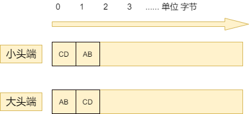

# 字节序-大头端小头端

## 前言
> 字节顺序，又称端序或尾序（英语：Endianness），在计算机科学领域中，指存储器中或在数字通信链路中，组成多字节的字的字节的排列顺序。[wikipad](https://zh.wikipedia.org/wiki/%E5%AD%97%E8%8A%82%E5%BA%8F)

大头端和小头端取自格列佛游记中的故事,用来表明字节序争论是无意义的.但是日常遇到大头端和小头端,我们需要清楚其中的差别. 近期看了《深入理解计算机系统》的部分内容，学到了字节序相关知识，分享一下，希望以后各位以后不会像我一样死记硬背: **大头序就是存储顺序和阅读顺序相同，小头序和它相反**

## 正文

十六进制数据`0xABCD`的内存地址**从0开始**,在大头端和小头端两种字节序是怎么存储的?

**以字节划分数据**，对大头端，**高位存在低地址处**；对小头端，**低位存在低地址处**。

### 字节划分数据，高低位，高低地址

字节划分数据由**存储器的特性**决定的，存储器的基本存储单位是字节（Byte）.一个字节由8位（Bit）组成，对`0xABCD` ，对应的二进制 `1010101111001101`共16位，需要两个字节存储 ，划分为 `10101011`（AB）和`11001101`(CD)。

高低位是数学知识，**从右到左位数上升**。还以`0xABCD`为例，A相对B是高位，B相对于A是低位， A是最高位，D是最低位, 结合这个概念 上面的 **`10101011`（AB）就是高位，`11001101`(CD)就是低位**

高低地址是**从左到右地址上升**， 假设存储空间的地址范围 为0~31. 0就是低地址，1相对0就是高地址。

### 字节序

结合上面几个概念，字节序就是**将数字按字节划分后，根据字节高低位决定的存储顺序**

## 后记
字节序有两个以迷惑的地方，

* 一切以字节为基础
  * 如果没能理解， 那么你可能理解成 在小头端时数据会被存储为`0xDCBA`！。 要记住所有的顺序都是基于字节的。

* 数字的高低位和高低地址

  * 数字的高低位从右到左位数上升，地址从左到右地址上升。不要把这两个混淆

最后再来一次口诀： **大头序就是存储顺序和阅读顺序相同，小头序和它相反**

---

[理解字节序](https://www.ruanyifeng.com/blog/2016/11/byte-order.html)
《深入理解计算机系统》