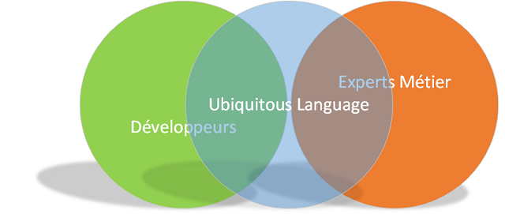

# DDD之初识

## 前言

大约一年之前,我第一次听说DDD,**Domain Drive Develop**,领域驱动设计. 找了下相关资料,看完之后对它兴趣更甚,这就是我心目中软件工程该有的样子呀! 
传统的开发模式有很多缺点

* pm的需求不明确, 想象力天马行空,总是说"这个需求很简单",不理解代码实现的复杂性
* 代码逻辑东拼西凑,每个人只明白自己负责的那块,没人知道改动代码会造成什么后果,因此没人敢去动老代码
* 每个人的对需求的理解不同, pm理解的是A,developer理解的是B,tester理解的是C
* 老项目代码混乱,积重难返,后期的维护成本极高.

DDD描绘了一个美好的场景:  pm,developer,tester一起讨论软件的功能,基于所有人的共识,构建一个统一的**领域**(Domain),developer将这个领域反映在代码中,pm根据这个领域改进需求,做下一步规划.随着软件的更新,领域随之更新,移除废弃过时的概念,融入新的概念,代码也随着领域更新换代.随着项目的发展,代码甚至可能更精炼.

本文将介绍DDD中的`Ubiquitous Language` 希望能帮助大家对DDD的了解

## 正文

### Ubiquitous Language(通用语言)

#### 传统模式的缺陷

日常讨论所使用的术语与代码（软件项目的最重要产品）中使用的术语不一致。甚至同一个人在讲话和写东西时使用的语言也不一致，这导致的后果是，对领域的深刻表述常常稍纵即逝，根本无法记录到代码或文档中.**翻译**使得沟通不畅，并削弱了知识消化。 然而任何一方的语言都不能成为**公共知识**(详见附录)，因为它们无法满足所有的需求.

#### Ubiquitous Language是如何解决这些缺陷的

Ubiquitous Language解决了这些问题,假设下面这个场景(*非实际场景,不完整*):

> pm提了新的需求,他觉得这个需求很简单,因此只用了一句话描述: 用户在新设备上登录后,旧设备需要被踢掉.
看似是一个单点登录的需求,developer却发现了一丝不寻常的气息,要知道我们的软件是拥有 pc,web,android/ios四个端的,假设用户在一台新的pc上登录.是三端同时踢出还是仅踢出pc的旧设备呢?  
于是developer叫上pm,tester一起讨论这个问题,最终得出结论,仅踢出同端的旧设备,不同端的无影响, 我们把这种这种方式称为**单端登录** ,SinglePlatformLogin,简称**SPL**.在之后的开发中,任何一个人提到SPL,大家都能立刻明白它的意思,SPL也出现在代码中,测试用例中,需求文档中.

上述的**单端登录**就是我们这个软件中的Ubiquitous  Language的一个名词.由此我们也可以归纳出Ubiquitous Language的特点

#### Ubiquitous Language的特点
* **领域中的概念,重要操作,规则都可以作为名词**. eg, 单端登录: 同端(pc/web/android or ios)设备仅能同时登录一个,多端不影响
* **名词通过讨论归纳总结得出,代表了公共知识**.  名词的意义融合了developer,pm,tester的理解,是所有人一致认可的.
* **名词的含义只在领域内有效**. 单端登录仅在这个领域内有意义,在另一个领域内它的意义可能是不同的

#### Ubiquitous Language可以更有用
Ubiquitous Language是我学习DDD过程中最大的收获,它是DDD的基石,也是一种通用的沟通方式,可以广泛应用在工作,生活中.比如这篇文章的Ubiquitous Language:

* **翻译**: 将自己对某件事的理解讲述给另外一个人
* pm,developer,tester: 产品经理,开发人员,测试人员.

比如领域驱动设计这本书中的Ubiquitous Language:

* 领域: 由现实中的场景,概念,行为抽象出的模型. 比如交易系统,物流系统
* 领域专家: 对某个领域很熟悉,掌握很多相关知识的人. 比如在物流行业工作了很多年的人.肯定对物流系统有很多了解.对软件开发领域来说,就是pm或者策划.他们不掌握知识,他们创造知识~

## 后记

我目前尝试将Ubiquitous Language应用在工作中,等实践一段时间后,可能会写一篇相关的文章,敬请期待哦~

---

[领域驱动设计](https://book.douban.com/subject/5344973/)

[李永乐老师讲什么是公共知识](https://www.youtube.com/watch?v=b7NZfkqFc6k)

[Ubiquitous Language图片](https://www.hack-my-domain.fr/en/the-ubiquitous-language/)

