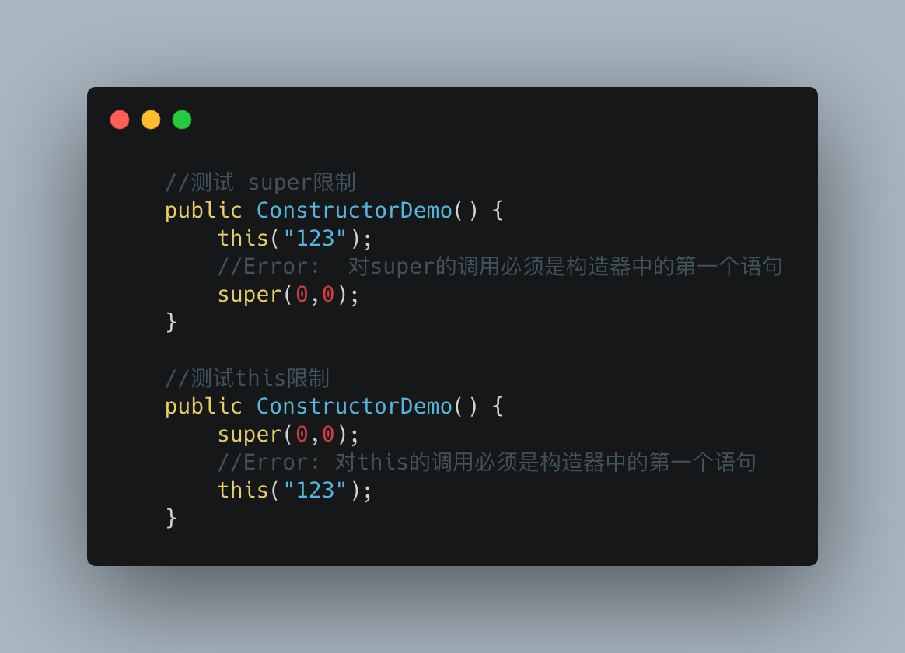
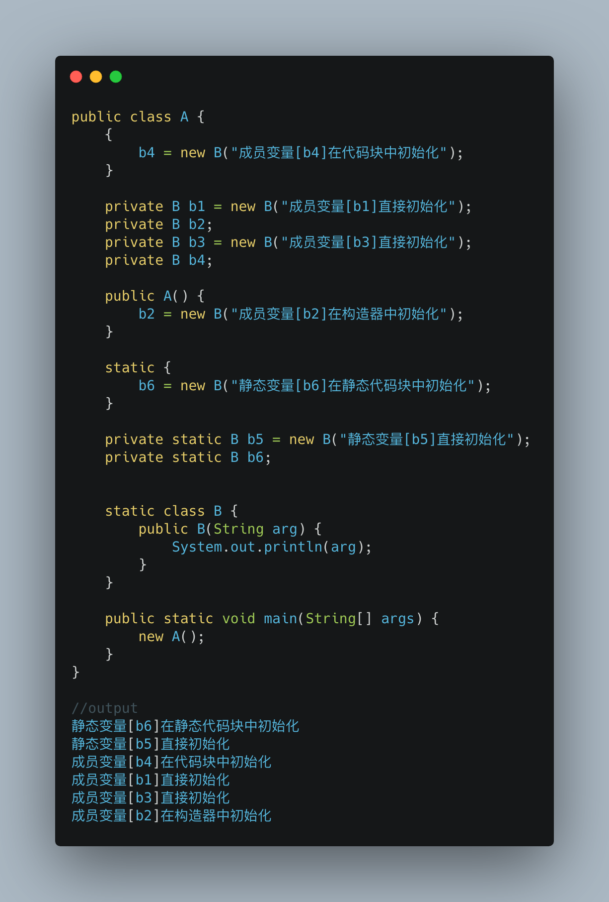
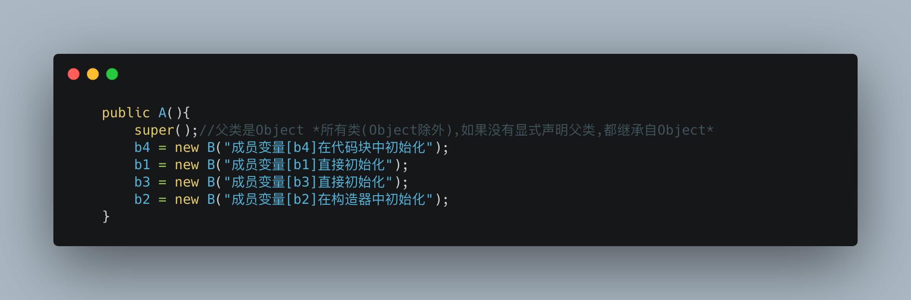
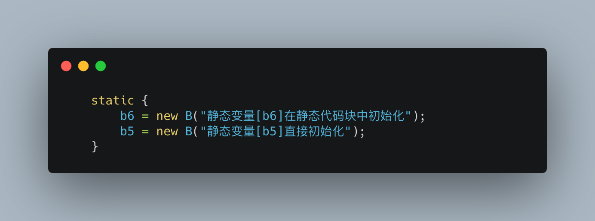
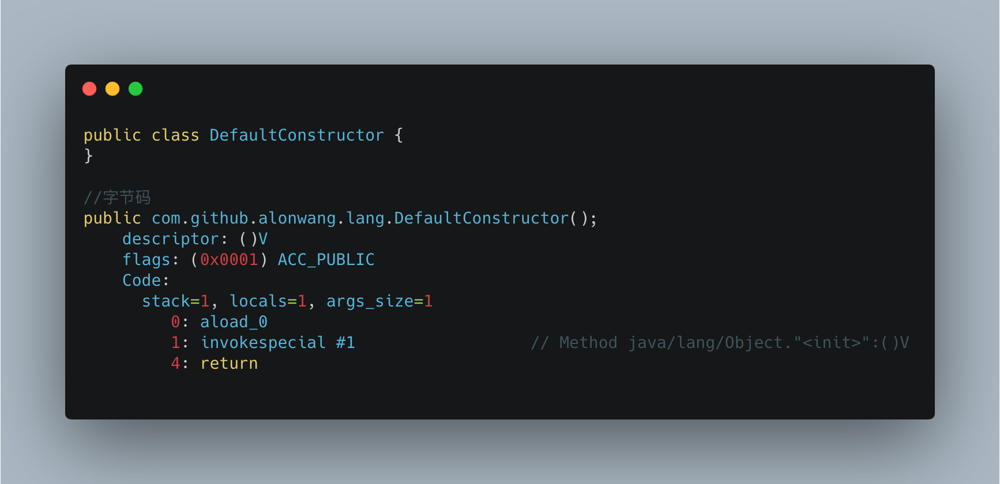
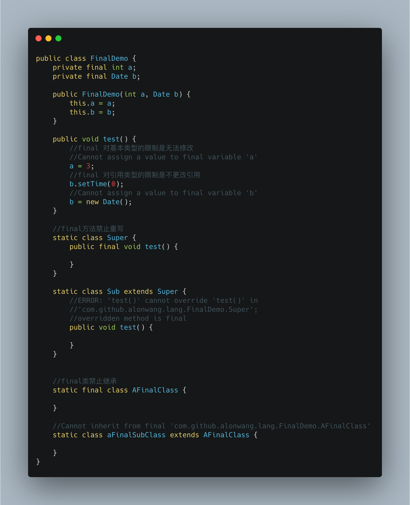

# Java基础

## 构造器

### 对super/this的调用必须是构造器中的第一条语句

* `super(args)`语法在当前构造器中调用父类构造器,

* `this(args)`语法在当前构造器中调用当前类的其他构造器.

* 这隐含着**在一个构造器中最多调用一次其他构造器**

### 调用构造器时的变量初始化顺序

想一下下面代码的输出顺序

**静态变量 ~= 静态代码块 > 成员变量 ~= 代码块 >构造器** *~=表示取决于在代码中出现的相对位置*

在字节码层面,A的构造器实质上是这样的,**编译器帮我们将这些直接初始化收集到了构造器中**

对静态变量,**编译器会将直接初始化的静态变量收集到静态代码块中**,实际效果为

### 如果没有定义任何构造器,编译器会生成一个无参构造器

请**一定一定一定确保有无参构造函数**,很过框架(fastjson,hibernate)都依赖于它,缺少很可能导致一些莫名其妙的问题,比如本地没问题,线上突然报错.所以请一定一定重视这个建议.

## final的语意

### final类,禁止继承

一个类被标识为final后,无法被继承,避免继承类破坏语意.如`String`,`Integer`.这两个都是很基础的类,本身有很多复杂的逻辑和内部的优化.不适宜被继承.

### final方法,禁止重写(override)

一个方法被标注为final后,禁止子类去重写这个方法,

### final字段,禁止修改

对于基本类型,不允许改变值,对于引用类型,不允许改变引用对象.

