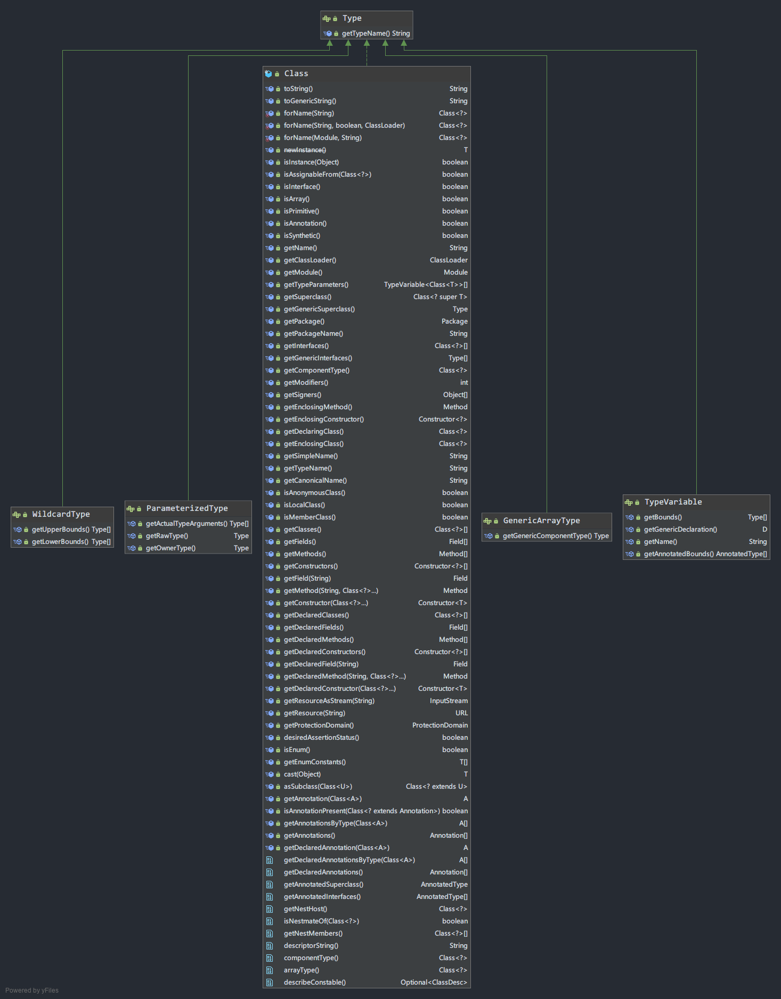

# Java中的Type

## 简介

泛型引入之前,Java中的类型系统很简单: 完全取决于Class,泛型引入后,变为以`java.lang.reflect.Type`为标识的,更加复杂的类型系统.本文将简述以Type为标识的类型系统的概念,构成和使用.

## 正文

### 回顾以Class为标识的类型系统

> Instances of the class Class represent classes and interfaces in a running Java application. An enum type is a kind of class and an annotation type is a kind of interface. Every array also belongs to a class that is reflected as a Class object that is shared by all arrays with the same element type and number of dimensions. The primitive Java types (boolean, byte, char, short, int, long, float, and double), and the keyword void are also represented as Class objects.
>
> Class表示在一个运行的Java应用中的类或接口. 枚举是一种特殊形式的类,注解是一种特殊类型的接口,数组属于也属于类(不好翻译,见谅),基础数据类型和Void也被表示为Class.

上面是摘抄Class的部分JavaDoc,看起来天大地大,Class最大, 由于所有对象都会对应某一个Class,因此在泛型出现之前,Class是具有类型标识的作用,   比如  `new String("a"),new String("b")`属于同一个Class `String.class`,`new String("a")`和`new Integer(1)`则属于不同的Class.

我们知道Java中的泛型是用擦除法实现的,这样实现的问题就是 `ArrayList<Integer>`和`ArrayList<String> `对应的class都是`ArrayList.class `,仅仅以Class做类型标识不够了,为了解决这个问题,Type应运而生.


### Type体系

> Type is the common superinterface for all types in the Java programming language. These include raw types, parameterized types, array types, type variables and primitive types.
>
> Type 是Java编程语言中所有类型的父接口,这包含 原始类型(raw types),参数化类型(parameterized types),数组类型(array types),类型变量(type variables),原始类型(primitive types).

**Type 是Java编程语言中所有类型的父接口**,再来看下Java编程语言的类型构成图,Class变为它的子类,其地位可见一斑.(再此感叹下Class,真是个大"类")



在Type体系下,Java编程语言共有四种"类型": 原始类型,参数化类型,类型变量,泛型数组类型

* **Class** 与之前的含义相同,代表**原始类型**
* **ParameterizedType** **参数化类型**, 比如` List<Integer>,List<Double>,List<T> `在这里参数化指的就是 `Integer`和`Double`,`T`. 
* **TypeVariable** **类型变量** 比如参数化类型中的 **T,**表示泛指任何类 
* **GenericArrayType** **泛型数组类型**. 比如List<T>[]，T[]这种。表示**一种** **元素类型 是参数化类****型或者类型变量的**数组类型。**
* **WildCardType **  **通配符类型** 表示通配符表达式, **它是Type的一个子接口,但是不作为Java中的类型**,表示 `? extend Number`, `? super Number`,`?` 这种

举个例子体会下Type的套娃.

```
方法签名
  public <T extends Number, R> R testType(List<Integer> a, List<List<Integer>> b, List<ArrayList<Integer>> c, List<T> d, List<? extends Number> e, List<? super Integer> f, List<List<Integer>[]> g, List<ArrayList<Integer>[]> h, Map<Integer, String> i ,T j ,List<?> k))
类型变量: -------------------------------------------
T 实现类:TypeVariableImpl
R 实现类:TypeVariableImpl
泛型参数(按照参数顺序):-----------------------------------
java.util.List<java.lang.Integer>	 实现类:ParameterizedTypeImpl
   内部  actualType: class java.lang.Integer 实现类: Class
java.util.List<java.util.List<java.lang.Integer>>	 实现类:ParameterizedTypeImpl
   内部  actualType: java.util.List<java.lang.Integer> 实现类: ParameterizedTypeImpl
java.util.List<java.util.ArrayList<java.lang.Integer>>	 实现类:ParameterizedTypeImpl
   内部  actualType: java.util.ArrayList<java.lang.Integer> 实现类: ParameterizedTypeImpl
java.util.List<T>	 实现类:ParameterizedTypeImpl
   内部  actualType: T 实现类: TypeVariableImpl
java.util.List<? extends java.lang.Number>	 实现类:ParameterizedTypeImpl
   内部  actualType: ? extends java.lang.Number 实现类: WildcardTypeImpl
java.util.List<? super java.lang.Integer>	 实现类:ParameterizedTypeImpl
   内部  actualType: ? super java.lang.Integer 实现类: WildcardTypeImpl
java.util.List<java.util.List<java.lang.Integer>[]>	 实现类:ParameterizedTypeImpl
   内部  actualType: java.util.List<java.lang.Integer>[] 实现类: GenericArrayTypeImpl
java.util.List<java.util.ArrayList<java.lang.Integer>[]>	 实现类:ParameterizedTypeImpl
   内部  actualType: java.util.ArrayList<java.lang.Integer>[] 实现类: GenericArrayTypeImpl
java.util.Map<java.lang.Integer, java.lang.String>	 实现类:ParameterizedTypeImpl
   内部  actualType: class java.lang.Integer 实现类: Class actualType: class java.lang.String 实现类: Class
T	 实现类:TypeVariableImpl
java.util.List<?>	 实现类:ParameterizedTypeImpl
   内部  actualType: ? 实现类: WildcardTypeImpl
```


### 了解这些有什么实际用途

**在代码中动态获取泛型的实际类型**,如下面这个例子,如何在代码中获取M的真实类型呢

```java
public abstract class AbstractSupplier<M extends CharSequence> implements Supplier<M> {
    Class<M> clazz;
    public AbstractSupplier() {
       //??? 如何获取M存储到clazz呢
    }

    @Override
    public M get() {
        /*some logic*/
        return null;
    }
}
public class StringSupplier extends AbstractSupplier<String> {

    @Override
    public String get() {
        return null;
    }

    public static void main(String[] args) {
        new StringSupplier();
    }
}
```
不了解Type体系,你肯定无从得知,了解Type体系后,摸索一下Class的API很容易就能解决
```java
public AbstractSupplier() {
// ParameterizedType StringSupplier<String>
Type genericSuperClassType = getClass().getGenericSuperclass();
// Class String
Type actualTypeArgument = ((ParameterizedType) genericSuperClassType).getActualTypeArguments()[0];
clazz=(Class)actualTypeArgument;
}
```


## 结语

以上是对Type系统的简单介绍,还有很多问题笔者没有去研究过,  如 Type这个接口本身也有一个对应的class文件,那这里是怎么处理的呢?  `sun.reflect.generics`这个包是泛型的基础,它是如何实现的呢? 还有很多很多问题等待去探究.

---

[【Type】类型 ParameterizedType](https://www.cnblogs.com/baiqiantao/p/7460580.html)

[Generics: How They Work and Why They Are Important](https://www.oracle.com/technical-resources/articles/java/juneau-generics.html)