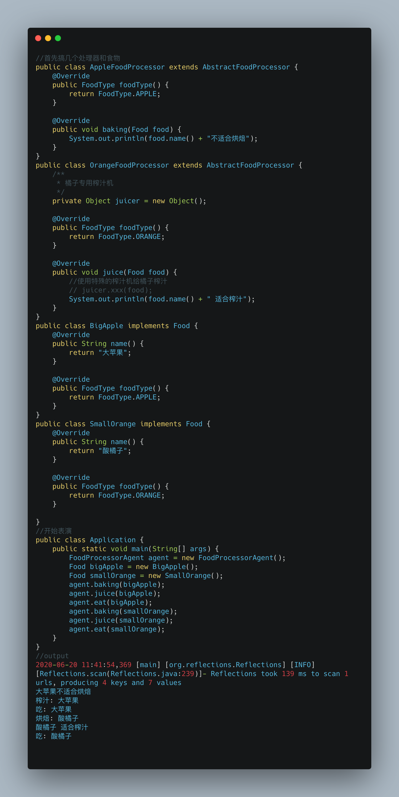

# 枚举和设计模式不得不说的故事

## 前言

之前的文章讲了如何[榨干枚举](https://alonwang.github.io/#/./article/Java/%E6%A6%A8%E5%B9%B2%E6%9E%9A%E4%B8%BE),这篇则会讲一下枚举如何与设计模式结合.

## 正文

### 困境

首先回顾下之前的用法,食物只能吃,逻辑简单,这样很好用.

但是如果食物不仅能`吃`,还可以`蒸`,`煮`,`榨汁`,`烘焙`.这样就会引发一些问题

* 枚举中的逻辑过多,很乱.
* 某些逻辑比如  "榨汁"会依赖外部对象"榨汁机",而由枚举的特性只能将榨汁机从外部传入,不太好.

### 引入设计模式

基于以上问题,我们将枚举与设计模式结合,创造出一种巧妙有用的组合,目的是

* 简单易用 用户开箱即用,不需要了解内部实现细节 ==> `抽象`,`简洁的api`
* 可拓展 以后可能增加新的食物类型,希望增加时尽可能简单 ==>`高内聚低耦合`,`单一职责`

#### 抽象

首先,我们抽象出食物,简单起见,只有两个要求: 食物名称,食物类型

其次,我们抽象出食物处理器,食物处理器可以对食物进行 吃,蒸,煮,榨汁等.

食物的某些处理方式可能是相似的,但是某些也有自己特殊的方式,为此我们再加一层抽象层,提供默认实现,同时允许不同类型的处理器提供自己的特定实现

最后,我们想让用户使用更方便,加一层代理. 这里我们用Reflections这个类库去获取所有实际的processor.并将它们隐藏在agent中. 如果你的项目中有spring,可以考虑使用 ApplicationContext.getBeansOfType()结合@Component替换Reflections.

来,展示最后的成果

上面这套设计,用户使用很方便, agent搞定所有.新增了食物类型时,只需要处理新增类型的处理器,除此之外,无需关心其他地方,

## 后记

设计模式并不是特别深奥的东西,只是实际项目中会混合多种模式使用,乍一看会觉得很复杂,这时不妨想一下作者这里这么做是要解决什么问题,再去看就会明了.