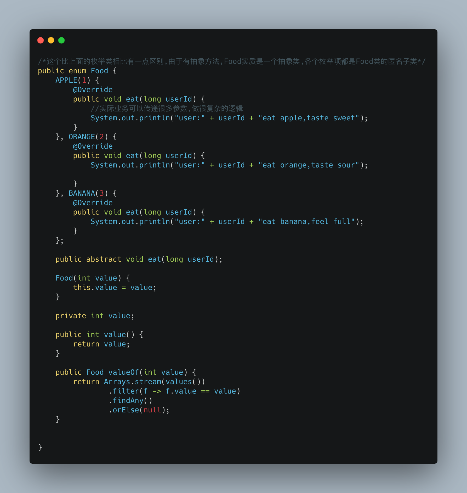

# 榨干枚举

## 前言

> 在[数学](https://zh.wikipedia.org/wiki/数学)和[计算机科学](https://zh.wikipedia.org/wiki/计算机科学)理论中，一个集的**枚举**是列出某些**有穷序列集**的所有成员的程序，或者是一种特定类型对象的计数。这两种类型经常（但不总是）重叠。
>
> 枚举是一个被命名的整型常数的集合，枚举在日常生活中很常见，例如表示星期的SUNDAY、MONDAY、TUESDAY、WEDNESDAY、THURSDAY、FRIDAY、SATURDAY就是一个枚举。
>
> [维基百科]([https://zh.wikipedia.org/wiki/%E6%9E%9A%E4%B8%BE](https://zh.wikipedia.org/wiki/枚举))

枚举**有穷序列集**的特性与现实中很多事物的特点相符,在编程中也极其有用.Java语言提供了枚举机制,日常开发我们可能只用到了它的基础功能,而实际上,得益于Java中枚举的实现机制,它还有很多有用的特性.本文将简单介绍Java枚举的原理.以及如何有效的使用枚举.

## 正文

### 枚举的基础用法

如果之前不了解枚举,那么最常用的形式可能是这样:手动给枚举加一个序号,并通过这个序号完成数字到枚举的转换,

这种方法当然可用,但是比较下代码量和便利性,好像不是很值得. 接口里定义变量当做枚举来做不是更香吗, 那枚举到底如何实现的呢?
### 枚举是一种特殊的类

枚举通过关键字`enum`定义,但实质上它还是类

编译器会对枚举做特殊处理,上面的Food枚举经过编译器处理后生成的字节码,我手动翻译为代码,大概是这样(*这段代码是不能运行的,编译器写死了Enum不能被直接编写代码继承*)

以上有几点需要注意

* Enum是一个抽象类,编译器使Food继承了Enum,*只能通过编译器处理去继承,不能在代码中手动继承*

* Food是 final的.原枚举中的枚举项被转换成Food类型的final类静态变量

* Enum有两个字段,name和orinal. name就是字段名,ordinal是序号,从0开始,由字段定义顺序依次递增.

* $VALUES是自动生成的枚举项的数组,下标和ordinal对应

* static代码块,values()方法,valueOf方法都是编译器自动生成的

  

### 既然如此,好玩的就来了
我们可以让枚举容纳业务逻辑,而不是在业务层去判断类型处理.例如

我们可以把这些逻辑搬移到枚举中

然后直接这样使用,是不是简单明了

# 后记

让我们一起,榨干枚举~

