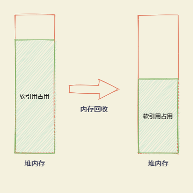
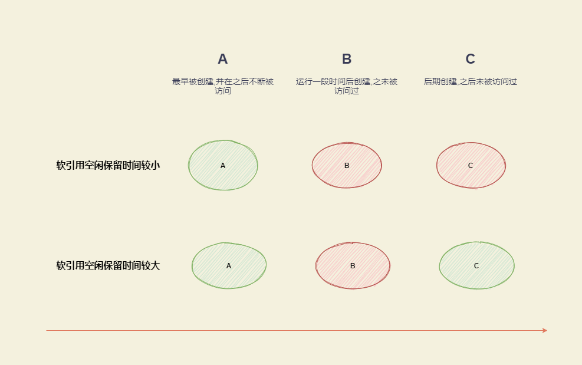

# 软引用的回收策略

Java中有四种引用类型,强,软,弱,虚.本文主要讲解软引用的回收机制.需要读者对软引用有基本了解.

## 正文

> 对于软引用关联的对象，在系统将要发生内存溢出异常之前，会把这些对象列入垃圾回收范围中进行回收。常用于实现对内存敏感的缓存

游戏开发中,对数据访问速度有较高要求,需要尽可能把数据放在内存中,然而内存是有限的,软引用在这种场景下极为有用: `内存充足时,软引用关联的对象都放在内存中,满足高速访问的要求, 内存不足时,软引用关联的对象被回收.保证系统正常运行`.

软引用在内存不足时被回收,对于如何回收,很多人可能并不清楚,下面就讲解一下软引用的回收机制.

### 问题

1. 如果有大量**仅被软引用关联的对象**(下面简称软引用),在系统将要发生内存溢出异常之前，会将这些对象全都回收吗? 

2. 在上一问的基础上, 软引用象基于什么回收策略

> TL;DR 
>
> 1. 不会,遵循按需回收原则
> 2. LRU,最近最久未使用策略

问题1容易理解,在保证系统能够正常运行的前提下,没必要全都回收. 举个例子, 堆内存100MB,软引用占了80MB,只剩20MB可用内存,触发了垃圾回收, 那么回收时没必要把80MB软引用都回收了,回收一部分,比如20MB,系统就有40MB可用内存,足以正常运行.



下面来详述问题2提到的软引用的回收策略

### 软引用回收策略解析

有两个关键属性

* clock 上次发生垃圾回收的时间戳,由垃圾回收器更新,全局共享
* timestamp 该软引用最后一次被获取的时间, 私有.

从这两个属性可得从上次gc起某个软引用未被访问的时间 `idletime`(可能为负值)

> idletime = clock - timestamp

同时我们有软引用空闲保留时间(全局) `idlelivetime`

> idlelivetime =  堆中剩余内存 (MB)* 每MB空闲内存保留时间

每MB空闲内存保留时间对应JVM参数  `-XX:SoftRefLRUPolicyMSPerMB`

**当需要对软引用进行回收时,idletime大于 idlelivetime的软引用会被回收.** 


### 软引用回收演示

以上是软引用回收策略的大致描述,JVM还会有更精细的控制和优化,所以很难根据上面的公式进行精准演示,下面就以一种简化的方式演示软引用回收的LRU.


```java
package com.github.alonwang.lang.ref;

import java.lang.ref.SoftReference;
import java.util.ArrayList;
import java.util.List;

/**
 * 软引用回收和LRU策略测试
 * JDK版本 Oracle JDK13
 * JVM启动参数
 * -Xmx10m
 * -Xms10m
 * -XX:-DisableExplicitGC
 * -XX:SoftRefLRUPolicyMSPerMB=1000
 * -verbose:gc
 *
 * 持续向内存中添加4KB大小的软引用对象,直到确保堆无法容纳所有对象.并间隙性强制触发GC.
 * 在添加结束后, 打印其中三个对象的信息:
 * A最早被创建,在运行过程中不断被访问
 * B在添加一部分后创建,之后没有访问过
 * C在偏后期创建,之后没有访问过
 *
 * 最终结果是
 * A未被回收
 * B被回收
 * C是否被回收 取决于 SoftRefLRUPolicyMSPerMB的值
 * * 为1时被回收
 * * 为1000时未被回收
 * (如果无法重现,请尝试修改C的下标)
 *
 * @author alonwang
 * @date 2020/11/19 10:32
 */
public class SoftReferenceDemo {
    /**
     * 近似4KB的内存块
     * 4024 byte
     * @return
     */
    private static int[] newBlock() {
        return new int[1000];
    }

    private static List<SoftReference<int[]>> list = new ArrayList<>();
    private static Object A(){
        return list.get(0).get();
    }
    private static Object B(){
        return list.get(999).get();
    }
    private static Object C(){
        return list.get(2099).get();
    }
    private static String pretty(Object o){
        return o==null?"被回收":"存活";
    }

    public static void main(String[] args) throws InterruptedException {
            for (int i = 0; i < 2500; i++) {
                list.add(new SoftReference<>(newBlock()));
                if (i%100==0){
                    System.gc();
                    A();
                    Thread.sleep(100);
                }
            }
        System.out.println("A: "+ pretty(A()));
        System.out.println("B: "+ pretty(B()));
        System.out.println("C: "+ pretty(C()));
    }
}

```



---

https://www.jianshu.com/p/f0da6c1af815