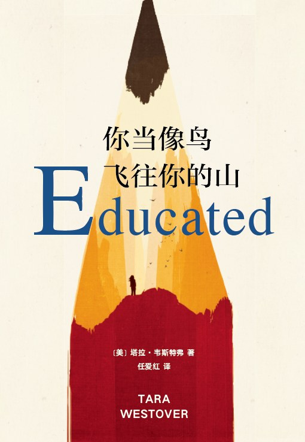

# 你当像鸟飞向你的山

这是一本自传性质的图书,描述了作者Tara Westover(塔拉)在一个恐怖的家庭中成长,觉醒,反抗,最终自我和解的真实故事.

### 故事概括

塔拉出生在美国爱达荷州的山区,是家里七个孩子中最小的,有一个集偏执狂,被害妄想,狂热到病态的摩西教信仰于一身的疯子般的父亲,一个软弱的母亲,一个施虐狂哥哥卢克,一个启蒙者哥哥泰勒,和其他相对正常的亲友. 

父亲是彻彻底底的疯子,他认为学校,医院是政府的阴谋,他禁止孩子们去学校上学,因此塔拉17岁前未上过学,其他几个孩子最多上到小学,他禁止家人去医院看病,即使在一次爆炸后,他的脸都被烧掉一半,仍然拒绝去医院;他囤积大量的食物“期待”圣经中描述的世界末日,家中的所有积蓄都被用来用来囤积食物;他幻想出政府要消灭他们,为此购买了大量武器作为防御,并在大脑中篡改了故事用来警示家人,让他们远离政府;

二哥卢克是一个施虐狂,他会因不满而在大街上拖行塔拉,有次竟笑着将她的脚趾掰断.他会给塔拉起各种羞辱性的外号取乐,他会因生气将赤裸的妻子扔在冰天雪地中,他是一个疯子.

母亲原本是一个富贵人家的孩子,她被父亲吸引,陷入爱河并结婚,.她在父亲的示意下做了违法的接生婆,后来开始调配药剂,在父亲的影响下她也变的不正常,幻想自己可以通过叩击肌肉卜卦,治病,传递能量,作为母亲,她是一个软弱的人,看到塔拉被卢克欺负,她只会躲到一边,不敢制止.

三哥泰勒是一个安静坚韧的孩子,他有力的反抗了这个家庭,他外出求学,走出了自己的人生路,开始了新的生活.也是一段时间内塔拉心底最大的依靠.

在这样的环境中塔拉长大成人.哥哥泰勒的一张唱诗班的唱片触发了她的觉醒,在她17岁那年靠自学和泰勒的辅导考入了杨百翰大学,开启了开挂般的人生,一路通关剑桥,哈佛,还都拿到了全额奖学金.
在这个过程她在新的生活中接触到的事物与她在原生家庭习得的发生了严重的冲突: 
* 被卢克叫做黑鬼她并无感触,但是在了解到解放黑奴运动后,她开始反抗这一行为
* 了解到父亲用来警示他们的那个故事是被篡改的后,她开始承认父亲的被害妄想,并以此做了大量研究
* 得知她的哥哥姐姐也曾被卢克欺辱后,她联合哥哥姐姐和父母沟通,让他们承认卢克有问题
* 牙齿痛到神经拒绝去医院,坚持半年后,在室友的劝说下,最终她去了医院.

在这个过程塔拉思考和反抗着家庭带来的影响,最终与自我和解.
### 我的体会
周末,我在一家书店三个多小时随机选择并读完了这本书.最开始我惊叹于世间竟有这么怪诞的家庭,在确认这是一个真实的故事后更觉震撼,但是好像还有一些能够触动我的东西还没有被挖掘出来,沉淀了一天之后,我想出了结果: 
> **从出生开始,我们的人生观,世界观,价值观就在被社会,家庭,教育深深影响并塑造着,而社会,家庭,教育都是有偏向和目的,比如政府会修改教材,引导舆论以达到政府的预期目标,这会致使我们的三观“扭曲”,使我们没有主见,没有自己的思想,如同牵线木偶般被操控**

要摆脱操控,就要掰正三观: **主动去接触新的事物**.当新的事物和你的固有的三观发生冲突时,思考就会发生,偏颇的观点终会失败,你的见识愈多愈广,你的三观就愈完善,你就成为自己的主人.主动去接触新的事物具体是什么?  我能给到最好的建议是读书,因为一本书中可能浓缩着某个人一生思想的结晶;其次是拓展你固有的生活,每天做一些从未做过的事情… **总之,主动去接触新的事物**!