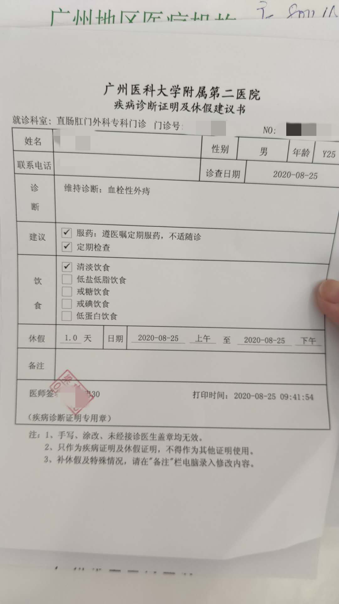

# 十男九痔,我是分子

前段时间饮食不规律,痔疮发作,苦不堪言,诉于诸君,请对号入座,无则加勉有则改之.

### 作死之旅

#### 没手机不能上厕所? 小心坠胀感

大约一个月之前,在公司带薪放大,手机刷的是不亦乐乎,待到双腿稍稍有点发麻,清理好起身,突觉一股**坠胀感**.心说糟了,尝试了提肛,感觉明显不对.想着过几天就会慢慢好了,也没太放在心上,仅仅是随后几天放大会注意下时间,慢慢的也就放松了警惕,恢复了日常状态.

#### 莫名奇怪的小疙瘩

某天洗澡突然发现出现一颗小疙瘩,黄豆大小,不疼不痒,也没什么感觉,心说这种自己会消下去的吧~

事实证明我错了,几天之后,非但没有消下去,反而开始疼痛,**如果将疼痛分成10级,这个也就2级**.

发展到这种情况,本来想去医院看,但是肛肠科的号周末美好,又不想请假,没办法,先去网上搜了下,又问了朋友,得出结论:**我是病是肛周脓肿**

#### 肛周脓肿? 别吓自己了

结合网上的资料和朋友的讲述,我怀疑自己是肛周脓肿,它的特点是 **无法自愈,越拖越严重,需要做两次手术**,卧槽? 卧槽!

赶紧请假,全勤什么的一边去吧,赶紧挂了工作日肛肠科的号. 在医院经过艰难的等待,终于到我,医生看了之后平淡的说:”**小问题,血栓型外痔,不用开药,慢慢就消下去了**“.

处于恐慌状态的我将自己在网上查到的信息也告诉医生,等我说完,医生好像感觉他的权威杯挑战了,眼神好像在质问我”你是信我还是信百度?“,自知失言的我没再多说.最终医生给开了一盒止疼的药膏,整个问诊三分钟结束~  

#### 又来! 恐怖的大疙瘩

上次过后,小疙瘩确实慢慢消下去了,因为不是很疼,药膏我也没用,原以为就这样痔疮离我而去.万万没想到,自己又把自己作死了!

那几天工作压力比较大,吃饭都是外卖,晚上回家又是一包零食起步,到了周末一坐一上午(在公司,我会强制一小时运动一下),在又一次厕所放大后,我意识到:**它回来了,而且更加可怕,鸽子蛋大小,疼痛级别达到7级,晚上睡觉都会疼醒**. 

在艰难的忍耐了两天之后,我妥协了,再一次去了医院,医生维持原判,依旧是**血栓型外痔**,可能医生也意识到这次有点可怕,额外开了药.让我慢慢修养.

#### 与痔疮的和解

两天之后,虽然大小没怎么变化,但是已经基本不疼了,本次危机解除,但是我意识到: **以后怕是甩不开痔疮了**

