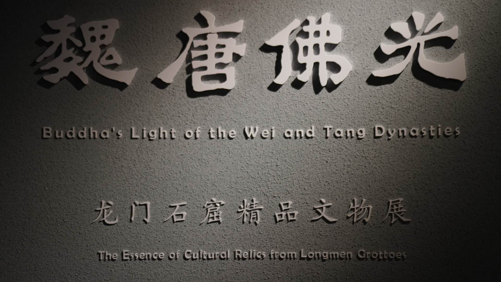
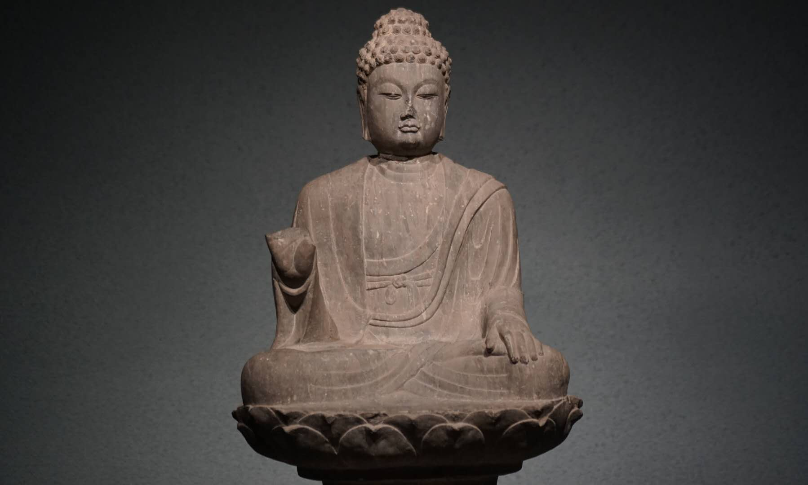
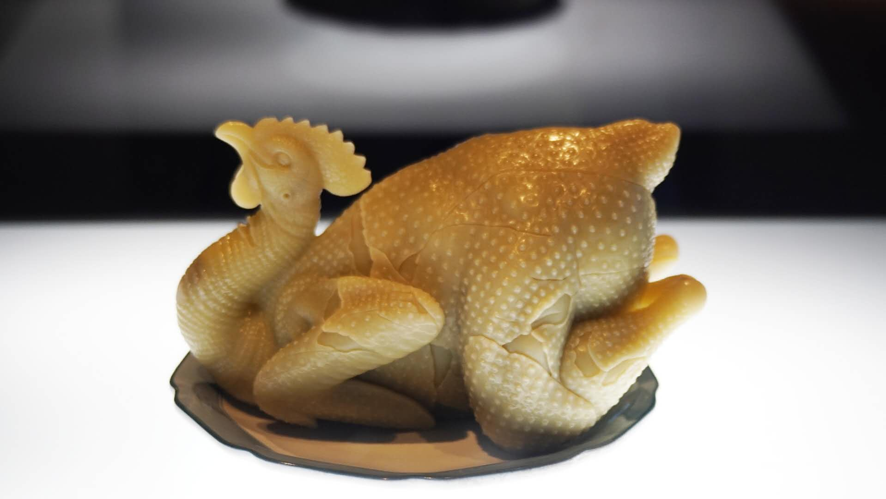
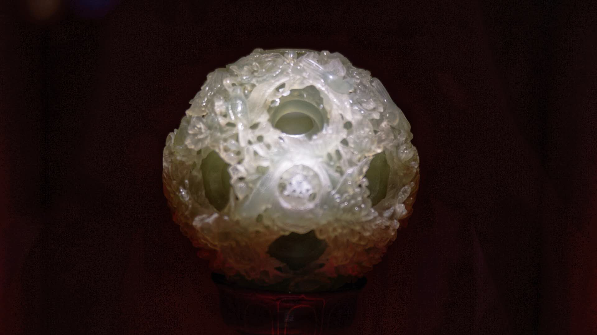
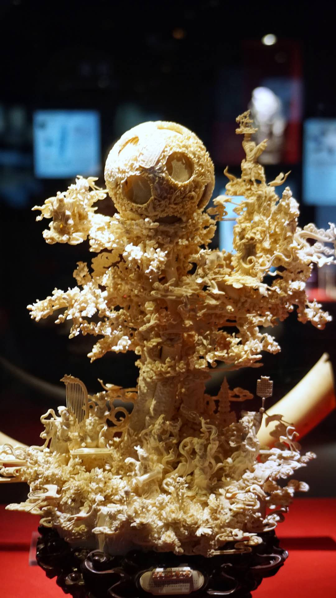
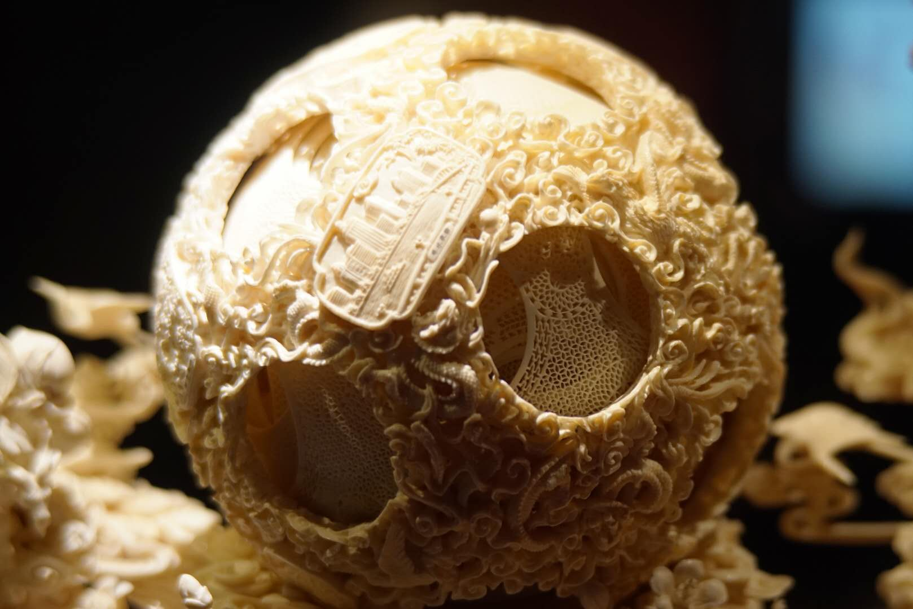
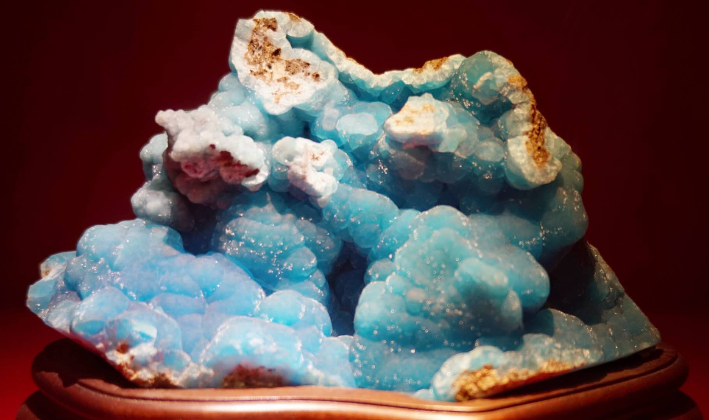
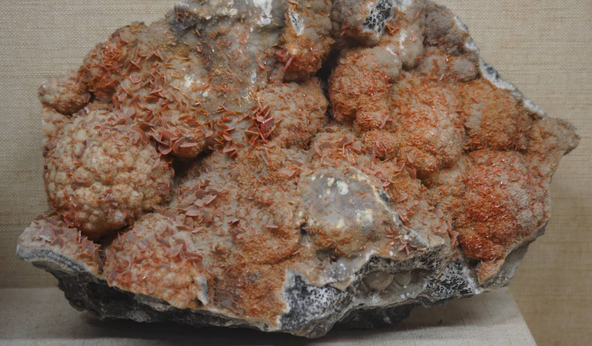

# 广东省博物馆游记

今天独自去了广东省博物馆.参观过程很愉快,心情都好了不少,果然,周末就是要出去游玩呐~

### 河南人在广东看河南文物

作为一个河南人,在广东看河南的文物,稍稍有点尴尬.说回这个展,体验不太好.

龙门石窟的特点就在于宏大,巍峨.这里只有几十尊小佛雕,而且佛雕的制作工艺在现在看来并不精细. 如果有没有很深厚的背景知识的话,很可能像我一样兴趣乏乏.

### 精致的文物,精致的广东人

马督工在独山县那期视频里说过:

> “要想看一个地方,了解一个地方,最快的方式就是去看它的博物馆,看这个地方的人怎么介绍自己”.

经过这次实践,我举双手赞同:广东的文物介绍了广东人.

图一, 玉雕鸡 

图二,玉雕 字母球 

图三,象牙雕刻

图四 象牙雕刻细节

这些雕刻文物和前面的佛雕形成的鲜明的对比,太精致了,令人叹为观止,我甚至觉得现代工艺都很难做到这么精致.

 想一下广东人的食物,也处处透露着精致. 大概这就是广东人的性格吧.

### 艺术来源于生活

图一 一块颜色绚烂的矿石

图二 看起来很恶心的一块矿石

图一矿石未经任何调色修改, 这有点冲击我的世界,在此之前,我一直以为这种颜色是人类创造,只在绘画等艺术上出现.现在看来是先在自然造物上出现,被人类发现后加以利用.

图二矿石看起来很像3A大作中恶魔巢穴蠕动的墙壁. 我十分倾向于是美术人员从这里获取的灵感. 

### 后记

这段时间很闲,闲到思考人生目标,想出了几个令我心灵触动的目标,其实一个是 : 去了解那些你未曾了解过的事物.

未来,我会继续.