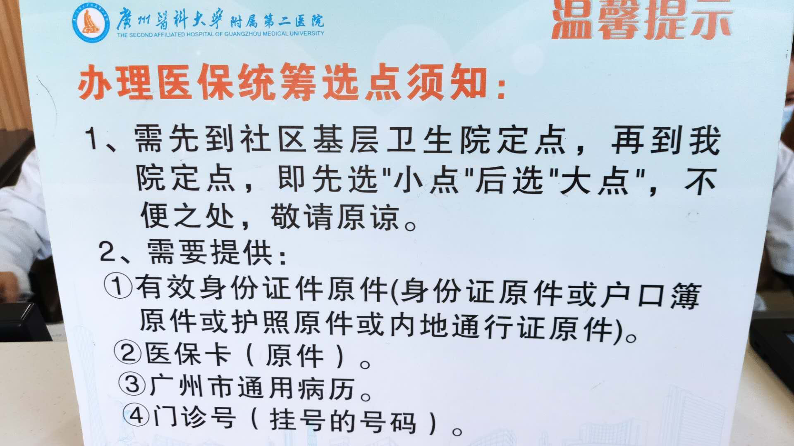

# 广州医保定点指南-2020

## 什么是医保定点

在广州，只有在你做了定点的医院才能享受医保折扣；在非定点医院只能够花个人账户的钱，不能享受医保折扣。医保折扣的力度很大，基本算半价了，所以强烈建议有了医保卡就去办了，以防后面突然生病，时间匆忙下没有定点导致白白多掏一笔钱。

定点又分为**大小点**。**小点**一般是社区医院，**大点**就是三甲，二甲医院。分大小点的目的是鼓励小病去小点看，小点看不了再去大点看，对此也有相应的优惠政策，从小点**转诊**到大点看病比直接在大点看病折扣更多。相关的医院目录请关注微信公众号**广州医保**，里面有详细的列表。

据我的亲身体验，办理速度很快，除去交通时间，大小点一共10分钟就搞定了。

## 办理流程

### 资料准备

* 社保卡
* 身份证
* 1~2块现金
  * 如果之前没有病例本，需要购买，有些地方只接受现金

### 时间安排

只要在医院的营业时间，就可以办理定点，而非在某些自媒体上看到的只能周一到周五

## 办理流程

大部分医院的流程应该都如下图，各个医院的具体办理位置到询问前台就好了。

*在该医院的微信公众号上注册账户就会自动生成门诊号*

