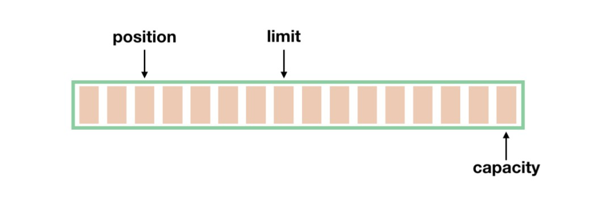

# Netty原理简介

## 前言


如果在Google上搜索"Netty 高性能 易用",在找到的一大批文章,你大概率会看到这张图,外加关键字`NIO`,`Reactor多线程模型`,`异步串行无锁化`,`堆外内存`,`pipeline` ,翻看完这些文章后可以让你对Netty的原理有大致了解,但是Netty如何实现这些的呢? 本文将简单解释NIO和(旧)IO区别,及Netty如何在NIO的基础上构建.

## 正文

### 站在NIO的肩膀上

Netty的底层是Java的NIO. 那就先来了解下NIO的几个关键组件,并与旧IO做对比

#### Buffer


Buffer是存储原始类型数据(byte,int,long,double)的容器.可进行读,写**操作**,有一些文章把这称为读写模式,个人觉得不太恰当,因此这里只用操作来表示,**Buffer可以使用直接内存,效率大大提高. 而旧IO是面对字节数组(byte[])的.**



Buffer有四个指标,控制着读写的范围.

* capacity Buffer的容量
* position  下一个读写操作的位置
* limit  `limit-1`表示最后一个可读写操作的下标
* mark 不常用  用来临时保存position,以便需要时复原

无论何时,**mark <= position <= limit <= capacity** 总是成立

在实现上分为

* Direct Buffer 直接内存实现,但是GC仍然由JVM控制,如果使用恰当,效率很高.
* Non-Direct Buffer 堆内存实现方式相当于对数组的封装,效率相对不高.

下面代码演示如何使用. 不得不说,API设计的不好,很难用.**这段代码可以略过，毕竟需要自己写它的机会不多**

```java
    public static void main(String[] args) {
        /**
         * 刚创建的buffer,没有数据,没办法也不可能读,此时只有写有意义
         */
        IntBuffer buffer = IntBuffer.allocate(100);
        System.out.println("创建一个容量为100的buffer." + indicator(buffer));
        buffer.put(1);
        buffer.put(2);
        //写入后 position会自动变化
        System.out.println("写入 1,2. " + indicator(buffer));

        /**
         * flip做了三个操作  limit = position; position = 0; mark = -1;
         * 实质就是根据当前已读写数据,限制读写范围,并让我们从头开始读/写
         */
        System.out.println("flip buffer. " + indicator(buffer.flip()));
        System.out.println("读取两个元素. " + buffer.get() + "," + buffer.get() + " ." + indicator(buffer));
        // ERROR 没有可读数据了
        //buffer.get();


        System.out.println("flip buffer. " + indicator(buffer.flip()));
        buffer.put(3);
        buffer.put(4);
        //ERROR 没有可写空间了
        //buffer.put(5);
        System.out.println("写入 3,4. " + indicator(buffer));

        /**
         * rewind的实质  position = 0; mark = -1;
         * 实质就是让我们从头开始读/写
         */
        System.out.println("rewind buffer. " + indicator(buffer.rewind()));
        System.out.println("读取两个元素. " + buffer.get() + "," + buffer.get() + " ." + indicator(buffer));

        System.out.println("rewind buffer. " + indicator(buffer.rewind()));
        buffer.put(5);
        buffer.put(6);
        System.out.println("写入5,6. " + indicator(buffer));

        /**
         * mark 记录现在buffer读取/写入到的位置 x. reset将position重置到位置x.
         */
        System.out.println("rewind buffer. " + indicator(buffer.rewind()));
        System.out.println("读取一个元素. " + buffer.get() + " ." + indicator(buffer));
        System.out.println("mark buffer. " + indicator(buffer.mark()));
        System.out.println("读取一个元素. " + buffer.get() + " ." + indicator(buffer));
        System.out.println("reset buffer. " + indicator(buffer.reset()));
        /**
         * clear的实质  position = 0; limit = capacity; mark = -1;
         * 清除限制,并从头开始读写
         */
        System.out.println("clear buffer. "+indicator(buffer.clear()));
    }

    private static String indicator(Buffer buffer) {
        return String.format("\t {位置: [%s],限制:[%s],容量:[%s]}", buffer.position(), buffer.limit(),  buffer.capacity());
    }
//output
创建一个容量为100的buffer.	 {位置: [0],限制:[100],容量:[100]}
写入 1,2. 	 {位置: [2],限制:[100],容量:[100]}
flip buffer. 	 {位置: [0],限制:[2],容量:[100]}
读取两个元素. 1,2 .	 {位置: [2],限制:[2],容量:[100]}
flip buffer. 	 {位置: [0],限制:[2],容量:[100]}
写入 3,4. 	 {位置: [2],限制:[2],容量:[100]}
rewind buffer. 	 {位置: [0],限制:[2],容量:[100]}
读取两个元素. 3,4 .	 {位置: [2],限制:[2],容量:[100]}
rewind buffer. 	 {位置: [0],限制:[2],容量:[100]}
写入5,6. 	 {位置: [2],限制:[2],容量:[100]}
rewind buffer. 	 {位置: [0],限制:[2],容量:[100]}
读取一个元素. 5 .	 {位置: [1],限制:[2],容量:[100]}
mark buffer. 	 {位置: [1],限制:[2],容量:[100]}
读取一个元素. 6 .	 {位置: [2],限制:[2],容量:[100]}
reset buffer. 	 {位置: [1],限制:[2],容量:[100]}
clear buffer. 	 {位置: [0],限制:[100],容量:[100]}
```


#### Channel

> A channel represents an open connection to an entity such as a hardware device, a file, a network socket, or a program component that is capable of performing one or more distinct I/O operations, for example reading or writing.

通道,**在NIO的语境下,Channel更倾向于可操作(读,写等)设备,实体,程序的抽象**,例如,FileChannel是对文件的抽象,我们可以对文件进行读写.**Channel是双向的,可以进行读取和写入操作,而IO中InputStream只能读取.OutputStream只能写入**. Channel使用**Buffer**作为数据传输的载体. 


#### Selector

**旧IO中通常是一个线程对应一个socket连接,而Selector使得单线程中可以可以处理多个socket连接**


Selector的基本思想是[多路复用]([https://zh.wikipedia.org/wiki/%E5%A4%9A%E8%B7%AF%E5%A4%8D%E7%94%A8](https://zh.wikipedia.org/wiki/多路复用)),Selector上可以注册Channel. Channel在注册到Selector的时候会标注自己感兴趣的事件,当这些事件发生时,Selector会通知到对应的Channel.

Selector中的事件有

- OP_CONNECT: 可连接 这个事件仅有客户端能使用
- OP_ACCEPT: 新的客户端接入,即新的客户端连接.这个事件能且仅能服务端使用.
- OP_READ: 可读 可以从Channel中读取数据
- OP_WRITE: 可写 可以向Channel中写入数据

Selector中的Channel分为三种

- ServerSocketChannel ServerSocket的抽象  服务端使用,它负责**新连接接入**
- SocketChannel Socket的抽象  客户端使用 它负责客户端与服务端的`连接,读,写`
- SocketChannel Socket的抽象,ServerSocket在`新连接接入`后,会生成一个Socket,它负责后续服务端与这个客户端的`读,写`

**注意** 一个应用程序中**Selector可以有多个,每个Selector上也可以注册很多个Channel**

在NIO中使用Selector挺麻烦,我这里不再演示,有兴趣的同学可以网上搜索一下.


#### Buffer,Channel,Selector的关系

Selector和Channel相互依存,而Channel的读写会用到Buffer. 如此一来三者形成铁三角

### Netty的降临

Netty是一套易用,高性能的网络框架.它主要做了下面这些事
* 基于Reactor多线程模型实现, 避免了旧IO时代一个Socket就需要一个线程很浪费的问题,大大增加了单机连接数,最大化性能
* NioEventLoop 封装了Reactor,实现**异步串行无锁化**
* ChannelPipeline 使用责任链模式.将请求与发送拆解为多个步骤.有效解耦.
* ByteBuf 与NIO的ByteBuffer相似,但是更好用,性能更高.

####  Reactor多线程模型

将**新连接建立**和**连接的读写**分离,并且**连接的读写尽量均分到多个selector上**,利用多线程提高性能.


Reactor多线程模型可以分为三块

- 1~3 mainReactor负责客户端接入,mainSelector上只注册了ServerSocketChannel
- 4~5 acceptor负责将接入的连接移交给subReactor 
- 6~9 subReactor负责连接的读写

**mainReactor负责客户端接入**

1. serverSocketChannel注册到mainSelector上,监听新连接接入(OP_ACCEPT)
2. client1开始连接
3. mainSelector通知serverSocketChannel有新连接接入

**acceptor负责将接入的连接移交给subReactor**

4. serverSocketChannel接受新连接,获得socketChannel

5. socketChannel按照规则(轮询调度)注册到subSelector{n}上,监听读事件(OP_READ)

**subReactor负责连接的读写**

6. client发送数据

7. subSelector通知SocketChannel有数据到达,socketChannel做相应的业务处理

8. socketChannel需要对client发送数据,先向subSelector监听可写事件(OP_WRITE).

9. subSelector通知socketChannel可写,socketChannel进行相应的业务处理

关键知识:

- acceptor是mainReactor和subReactor的连接桥梁. 运行时,它只是作为mainReactor中的一段逻辑存在.
- subReactor有多个,新的连接会按照规则选择其中一个进行注册监听.**多线程**说的就是subReactor
- Selector和线程的关系是1:1.也就是说  mainReactor占据一个线程, 每个subReactor占据一个线程.

#### NioEventLoop

**它的作用是Selector,Executor,ScheduleExecutor三者的结合体**

 EventLoopGroup的基本组成如下图,结合Reactor模型,**上面的mainReactor就是只有一个NioEventLoop的NioEventLoopGroup**(为什么只有一个? 因为ServerSocketChannel只有一个),**subReactor就是有多个NioEventLoop的EventLoopGroup**


* channel是绑定在Selector上的, 而Selector是绑定在NioEventLoop上的,

- task queue 是一个 MPSCQ( multi producer single consumer queue),channel的很多操作在执行前都会检查是否在对应的NioEventLoop线程中,如果不在会将操作封装成Runnable丢到task queue里,而这个task queue只有这个NioEventLoop会慢慢消耗,以此实现Netty的**异步串行无锁化**,
- schedule task queue 是一个非线程安全的Priority Queue,**用来实现定时任务**

**运行流程图**


关键知识:

- 当外部线程第一次向NioEventLoop的task queue放入任务时,会启动NioEventLoop对应的线程并开始这个流程,一个死循环
- 就绪事件包含所有事件类型.OP_CONNECT(客户端会用到),OP_ACCEPT,OP_READ,OP_WRITE, 也就是说mainReactor和subReactor都在这里处理.
- selector阻塞获取阶段和运行task queue中的所有task阶段的运行时间有一个平衡, 确保事件处理和任务执行的平衡.
- schedule task在运行结束后会放回到schedule task queue里

#### ChannelPipeline

在以前的NIO中. 编解码,业务逻辑可能是杂糅在一起的.Netty引入了ChannelPipeline便于用户将这些分离开.


ChannelPipeline的设计思想是[责任链设计模式](https://juejin.im/post/5a126b146fb9a0450c490201),是由ChannelHandlerContext组成的`双向链表`, ,首尾固定为`HeadContext`和`TailContext`,它们作为哨兵存在.当我们添加一个**ChannelHandler**到ChannelPipeline时,会先包装成**ChannelHandlerContext**再添加进去.

**inbound事件传播**

客户端向服务端发送消息,这个流向就称为inbound. 消息会从Head开始由左向右传递直到Tail,由Tail进行收尾操作

**outbound事件传播**

服务端向客户端发送信息,这个流向称为outbound,消息会从Tail开始由右向左传递直到Head,由Head进行收尾操作

**异常传递**

当某个ChannelHandler操作抛出异常,会从该handler开始向Tail传递.由Tail做收尾操作.

#### ByteBuf

**Netty中接收消息,发送消息,都通过ByteBuf完成**


与ByteBuffer类似,但是有以下优点

* 提供池化和非池化方式, 性能更高
* 使用引用计数回收,不通过GC,性能更高
* 支持动态扩容
* 应用层的零拷贝 
* API更好用,更方便
* 使用jmalloc进行内存分配. 性能高


## 后记

Netty重点要理解Reactor模型,搞懂NioEventLoop的逻辑.

---

[https://blog.csdn.net/difffate/article/details/69458588](https://blog.csdn.net/difffate/article/details/69458588)

[https://blog.csdn.net/jjzhk/article/details/39553613](https://blog.csdn.net/jjzhk/article/details/39553613)

[https://www.jianshu.com/p/a9b2fec31fd1](https://www.jianshu.com/p/a9b2fec31fd1)

[https://www.jianshu.com/p/a9d030fec081](https://www.jianshu.com/p/a9d030fec081)

[https://juejin.im/post/5b4570cce51d451984695a9b](https://juejin.im/post/5b4570cce51d451984695a9b)

[https://www.jianshu.com/p/2461535c38f3](https://www.jianshu.com/p/2461535c38f3)

[https://juejin.im/post/5a126b146fb9a0450c490201](https://juejin.im/post/5a126b146fb9a0450c490201)

https://segmentfault.com/a/1190000006824155

http://www.ipshop.xyz/10315.html

https://juejin.im/post/5c468f7be51d45524976275d