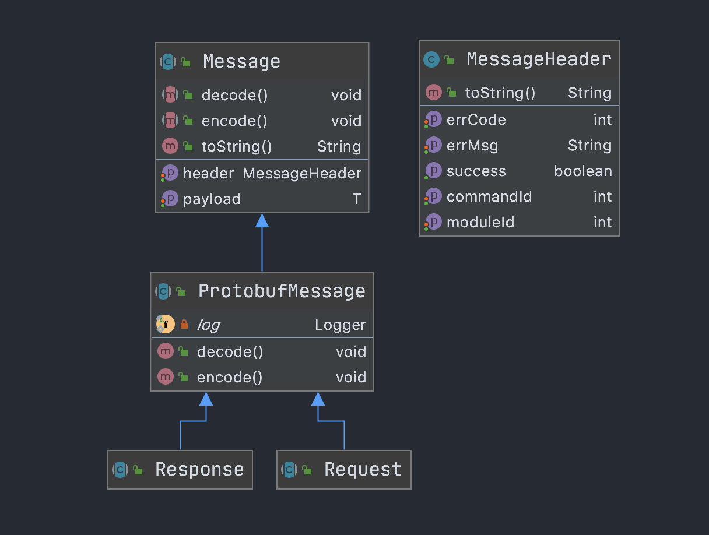

# 打造自己的通信框架三——协议的代码实现

## 前言

协议只是规定了数据交换格式,为了在代码中更方便的使用,我们需要将其映射到代码中

## 正文

下图是Protocol映射到代码中的结构

* Message对应Protocol,是最基础的结构,encode和decode实现编解码
* MessageHeader封装了除payload外的所有数据
* ProtobufMessage提供默认的编解码实现
* Request,Response标识Message的类型



举个例子,有一个协议包,proto格式为

```protobuf
message HelloMessage {
    string msg = 1;
}
```

将它映射到代码中就是下面这样,其中HelloMessage是上面的proto自动生成的java类

```java
@MessageId(moduleId = MessageIds.HelloModule, commandId = MessageIds.Hello.hello)
public class HelloRequest extends Request {
    private HelloMessage req;
}
```

下面就详细讲解各个部分的设计思路.

### Message

```java
public abstract class Message<T> {
    /**
     * 消息头
     */
    private MessageHeader header;
    /**
     * 有效载荷
     */
    private T payload;

    /**
     * 将有效荷载转换为消息中的特定数据结构.
     *
     */
    public abstract void decode();

    /**
     * 将消息中的特定数据结构转换为荷载
     */
    public abstract void encode();
		
  	//省略getter/setter...
  
}
```

Message是协议的java实现,两者的字段是等同的.


顶层——MessageHeader和AbstractMessage

消息可能会包含一些额外信息(moduleId,commandId,发送时间等等)，将这些信息放在MessageHeader里,以便拓展

```java
public  class MessageHeader {
    private final int moduleId;
    private final int commandId;

    public MessageHeader(int moduleId, int commandId) {
        this.moduleId = moduleId;
        this.commandId = commandId;
    }

    public int getModuleId() {
        return moduleId;
    }

    public int getCommandId() {
        return commandId;
    }
}

```

消息还必须有实际数据body,它在传输过程中会进行编码和解码.因此我们也必须有编解码方法,定义AbstractMessage如下

```java
public abstract class AbstractMessage {
    private MessageHeader header;
    private Object body;

    public MessageHeader header() {
        return header;
    }

    public Object body() {
        return body;
    }
    public abstract void decode() throws Exception;

    public abstract void encode();

    public void setHeader(MessageHeader header) {
        this.header = header;
    }

    public void setBody(Object body) {
        this.body = body;
    }

    @Override
    public String toString() {
        return "AbstractMessage{" +
                "header=" + header +
                ", body=" + body +
                '}';
    }
}

```


### Request

Request的header目前和MessageHeader一致,直接继承一下

```java
public class RequestHeader extends MessageHeader {
    public RequestHeader(int moduleId, int commandId) {
        super(moduleId, commandId);
    }
}
```
定义AbstractRequest如下
```java
public abstract class AbstractRequest extends AbstractMessage {
    @Override
    public RequestHeader header() {
        return (RequestHeader) super.header();
    }

    @Override
    public ByteString body() {
        return (ByteString) super.body();
    }

}
```
### Response
Response的header多出了errorCode,定义ResponseHeader如下
```java
public class ResponseHeader extends MessageHeader {
    private final int errorCode;

    public ResponseHeader(int moduleId, int commandId, int errorCode) {
        super(moduleId, commandId);
        this.errorCode = errorCode;
    }

    public int errorCode() {
        return errorCode;
    }

    public int getErrorCode() {
        return errorCode;
    }
}
```

定义AbstractResponse如下

```java
public abstract class AbstractResponse extends AbstractMessage {
    @Override
    public ResponseHeader header() {
        return (ResponseHeader) super.header();
    }

    @Override
    public ByteString body() {
        return (ByteString) super.body();
    }
}
```


### 示例

下面展示一个Request,一个Response.这里我们借助protobuf简化, 直接在内部封装下Protobuf的原始数据.

encode和decode方法后续可能通过其他方式优化,如反射.

```java
public class HelloRequest extends AbstractRequest {
    private Hello.HelloMessage body;

    @Override
    public void decode() throws InvalidProtocolBufferException {
        body = Hello.HelloMessage.parseFrom(body());
    }

    @Override
    public void encode() {
        setBody(body.toByteString());
    }

    public Hello.HelloMessage getBody() {
        return body;
    }

    public void setBody(Hello.HelloMessage body) {
        this.body = body;
    }
}
```

```java
public class HelloResponse extends AbstractResponse {
    private Hello.MeToMessage body;

    @Override
    public void decode() throws InvalidProtocolBufferException {
        body = Hello.MeToMessage.parseFrom(body());
    }

    @Override
    public void encode() {
        setBody(body.toByteString());
    }

    public Hello.MeToMessage getBody() {
        return body;
    }

    public void setBody(Hello.MeToMessage body) {
        this.body = body;
    }
}
```

至此,Request,Response的封装结束

## 后记
这一阶段经历了很长时间,主要有三点比较困惑
1. 是否需要MessageHeader

2. 编码解码到底如何做

3. 怎么才能支持多种数据格式(Protobuf,JSON等等)

这几点的核心问题是相同的, 做的太少,设想的太多,导致后面没办法进行下去, 认识的这一点后,开始边做边试.最终这三个问题通过 "堵疏斩替"全都解决了

1. 是否需要MessageHeader
   需要,Request和Response包含的元数据部分是不同的.并且他们需要是可拓展的,

2. 编解码到底如何做

   AbstractMessage暴露body给子类,再加上利用Protobuf自有的功能,最终实现的时候出乎意料的简单

3.  先用protobuf,真的有其他格式的需求了再做

