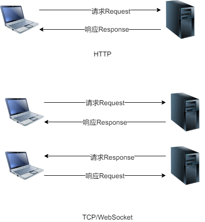

# 打造自己的通信框架二——自定义与客户端交互的协议格式

# 前言

在本篇，将设计与客户端通信的协议格式.

## 正文

### 请求响应的语义问题

首先要明确,**请求响应的含义在单向通信与双向通信是不同的** 

请求(Request)响应(Response)有两种不同的语义,下面用**中文表示行为,英文表示数据.**

* 作为行为

  请求是发送一些数据,响应是在接收到一些数据后,返回一些数据

* 作为数据

  请求是作为一些数据,响应也是作为一些数据

HTTP是单向通信,只能由客户端发起**请求(Request)**,服务端接收**请求(Request)**并返回**响应(Response)**.服务端不能主动发起**请求(Response)**.在这种模式下,**请求对应Request，响应对应Response** 

在TCP和WebSocket中,是双向通信,如果套用**请求响应**,客户端发起**请求(Request)**,服务端接收**请求(Request)**，可能返回**响应(Response)**,连接建立后,服务端也能发送**请求(Response)**.客户端接收**请求(Response)**,可能返回**响应(Request)** . 可以看出,在双向通信中. **在客户端,请求响应都是Request,在服务端,请求响应都是Response**



### 设计协议格式
以proto格式来描述

```protobuf
/**
请求
 */
message Request {
    int32 moduleId = 1; //模块id
    int32 commandId = 2; //命令id
    bytes body = 3;
    //TODO 待拓展
}
/**
响应
 */
message Response {
    int32 moduleId = 1; //模块id
    int32 commandId = 2; //命令id
    bytes body = 3;
    int32 errorCode = 4; //0表示正常 其他表示错误码
    //TODO 待拓展
}
message Error{
	string errorMsg=1;//错误信息
	//TODO 待拓展
}
```

#### moduleId和commandId
Request和Response都是协议包,需要有一个唯一标识,前后端才能正确映射处理.这里采用moduleId和commandId组合来唯一标识一个协议包.相比只是用commandId,这样有什么好处呢?
1. 将同模块业务代码归纳在一起
考虑登录业务,一般会有  登录,注册,退出这几个接口, 我们可以这样配置
```
moduleId=1;//登录模块
comamndId=1;//登录
commandId=2;//注册
commandId=3;//退出
```
后端写业务接口时,可以根据moduleId将下属的commandId对应的处理逻辑都归纳到一个service下面.
2. 不需要再考虑命令预留
如果只是用commandId,并且不确定这个模块会不会很复杂,你可能会预留100个id,比如100~200.但是有了moduleId,就起到隔离的作用,不用再考虑命令预留问题

#### Response的errorCode
如果客户端发送的请求数据不符合业务逻辑,那么服务端是有义务通过某种方式提醒客户端的,这里我期望通过errorCode达成这个目标,期望是客户端收到协议包后会检查errorCode,如果errorCode为0,表示正常,body里就是约定的数据,如果不为0,body里就Error,

## 后记

自定义协议这里,理清楚请求响应花费了很长时间,真正制定协议并不困难.


---

[全双工](https://steemit.com/tcp/@cifer/tcp)

[HTTP与WebSocket比较](https://blog.csdn.net/CoderTnT/article/details/81104970 )

[HTTP单向连接](https://blog.csdn.net/cyb519/article/details/79046833)

