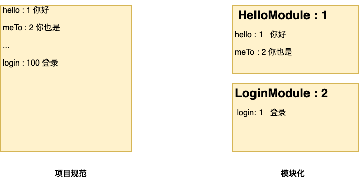
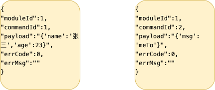
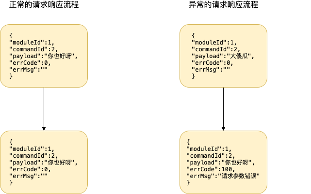

# 打造自己的通信框架二——自定义与客户端交互的协议格式

# 前言

在本篇，将设计与客户端通信的协议格式.

# 正文

### 请求响应的语义问题

首先要明确,**请求响应的含义在单向通信与双向通信是不同的** 

请求(Request)响应(Response)有两种不同的语义,下面用**中文表示行为,英文表示数据.**

* 作为行为

  请求是发送一些数据,响应是在接收到一些数据后,经过一些处理,返回另外一些数据

* 作为数据

  请求是作为一些数据,响应也是一些数据

HTTP是单向通信,只能由客户端发起**请求(Request)**,服务端接收**请求(Request)**并**必须**返回**响应(Response)**.服务端不能主动发起**请求(Response)**.在这种模式下,**请求对应Request，响应对应Response**  **请求和响应是一一对应的**

在TCP中,是双向通信,如果套用**请求响应**,客户端发起**请求(Request)**,服务端接收**请求(Request)**，**可能**返回**响应(Response)**,连接建立后,服务端也能发送**请求(Response)**.客户端接收**请求(Response)**,可能返回**响应(Request)** . 可以看出,在双向通信中. **在客户端,请求响应都是Request,在服务端,请求响应都是Response** **请求不一定有响应**


### 设计协议格式


首先来看协议的proto格式描述,下面再详细讲解各个部分设计的原因

```protobuf
/**
协议包
 */
message Protocol {
    int32 moduleId = 1; //模块id
    int32 commandId = 2; //命令id
    bytes payload = 3; //有效荷载
    int32 errCode = 4; //0表示正常 其他表示错误码
    string errMsg = 5; //错误信息
    //TODO 待拓展
}
```

请求和响应使用同一个结构,它包含标识,数据,错误三部分.

#### 如何标识一个协议包

Protocol需要有一个唯一标识,程序才能正确映射处理.有两种选择




##### 1. 项目规范--使用commandId唯一标识一条消息

这种形式下,直接由commandId唯一确定协议包,优点是**简单易操作**,缺点是

1. **无法反映出模块概念**,比如登录的commandId为1, 仅从这个信息无法得知它属于Hello模块

2. 每个模块的id范围很难界定. 多人开发容易出现冲突问题. 比如A用了1-50的commandId,B不知道这一点用了30-50的commandId

目前常见的解决方法是每个模块固定个数的commandId. 例如Hello模块的协议id为 1~99, 客气模块的协议id为100~199.

##### 2. 模块化

模块化使用moduleId和commandId组合唯一确定协议,优点是体现了模块的概念,缺点是用起来相对复杂


综合考虑后**采用了模块化的方式**.**模块是软件开发中很重要的抽象.我希望协议能体现出这一点**

#### 有效载荷

payload记录了协议的有效数据,它的格式由使用者根据协议包标识确定,下面两个不同标识的协议包对应payload的格式也不同



#### 异常状态

如果客户端发送的请求数据不符合业务逻辑,服务端有两种选择

1. 忽略这个请求,客户端不会得到任何响应
2. 返回协定的响应,但是响应中不含有效荷载,而是用非零的errCode表示这个请求数据有问题.客户端据此处理自己的逻辑

第一种选择明显不太好,用户请求后却没有收到响应,也不知道发生了什么.**第二种是比较好的选择,告知客户端你的请求有问题,问题在哪.**





我期望通过errCode和errMsg达成这个目标,期望是客户端收到协议包后会检查errCode,如果errorCode为0,表示正常,payload里就是约定的数据,如果不为0,表示出现异常,需要客户端根据errCode和errMsg做处理.

## 后记

本章介绍了请求响应在HTTP和TCP中的语义差别,而后讲解了协议的三个组成部分--标识,数据,异常状态


---

[全双工](https://steemit.com/tcp/@cifer/tcp)

[HTTP与WebSocket比较](https://blog.csdn.net/CoderTnT/article/details/81104970 )

[HTTP单向连接](https://blog.csdn.net/cyb519/article/details/79046833)

