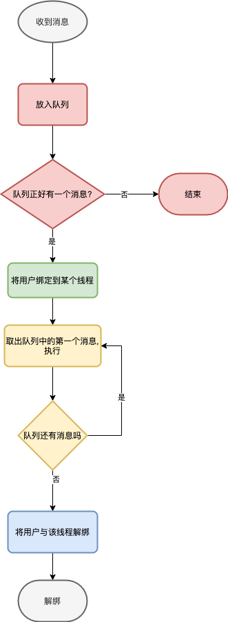

# 打造自己的通信框架五——异步串行无锁化

# 前言

上一节我们已经将消息分发给用户.下面要思考如何去执行这些消息

# 正文

##  多线程VS单线程

处理方案需要保证

* **异步性**,不能阻塞消息分发线程, 假如分发线程分发了多条消息,不能因为上一条消息还没处理完就阻塞它.

* **有序性**,消息处理需要保证有序,先到先处理.
* **尽量少的内存冲突**.如果出现内存冲突,就需要加锁保证正确性,必定影响执行效率,开发难度大大增加.

下面我们看下多线程和单线程两种方案的优劣

###多线程,NO!

假如我们将同一用户的多条消息放到多个线程处理,可能出现以下问题

* **大量的内存冲突**. 它们可能会同时修改这个玩家的数据,导致内存冲突问题,
* **消息乱序**,由于线程调度不可预测,不同消息的执行复杂性不同,可能出现用户X的发送的消息A比消息B更早收到,但是消息B比消息A先处理的情况.即**无法保证有序性**

因此多线程方式不可取.

### 单线程,YES!

对单线程方案,每个用户都需要一个队列去存储它们的消息.由**某个特定的线程**去消耗这些消息.它能满足处理方案的所有要求:

* 分发线程只需要将消息放到队列即可,**不会阻塞**
* 消息是按收到的顺序依次执行的,**不会乱序**
* 只有单个线程访问修改这些数据,**很少有内存冲突**

单线程方案很好,满足了上面的三个条件,但是还有一个关键点需要确定,**某个特定的线程**到底是啥?

“某个特定的线程”==线程池+空闲处理

**我们不可能给每个用户一个独立的线程**,如果在基于Netty的方案中使用这种方式,那是在侮辱Netty. 

首先借鉴Netty的思想,**我们使用线程池,将用户随机绑定到线程池的某个线程上**.

其次,考虑这种系统的特点,一段时间内有一部分用户是不活跃的,他们不会发送或接收任何消息.因此 **有消息时,将用户与线程绑定,无消息时解绑**

## 单线程实现

具体的流程如下图




单线程实现分为三块

* 添加消息 将消息添加到队列中,如有必要启动**绑定线程**流程 对应途中的红色部分
* 绑定线程 将用户和线程绑定起来,并开始**处理消息**,对应绿色部分
* 处理消息 依次消耗处理队列中的消息,并在消息处理完时**解绑线程**,对应黄色部分
* 解绑线程 将用户和线程解绑. 对应蓝色部分

下面来看核心实现DefaultTaskExecutor,和上图的对应关系已在注释中标明

```java
public class DefaultTaskExecutor<T extends TaskExecutor<?>> implements Runnable, TaskExecutor<T> {
    private static final ExecutorService DEFAULT_EXECUTOR_SERVICE = Executors.newFixedThreadPool(Runtime.getRuntime().availableProcessors() * 2, new CustomizableThreadFactory("MessageTask-Worker"));
    private final ExecutorService executorService;
    private final Queue<Task<T>> tasks = PlatformDependent.newMpscQueue();
    private final AtomicInteger size = new AtomicInteger();
    private volatile Thread current;

    public DefaultTaskExecutor() {
        executorService = DEFAULT_EXECUTOR_SERVICE;
    }
		//添加信息
    @Override
    public void execute(Task<T> task) {
        tasks.add(task);
        int curSize = size.incrementAndGet();
        if (curSize == 1) {
            //绑定线程
            executorService.execute(this);
        }
    }
		//处理信息
    @Override
    public void run() {
        this.current = Thread.currentThread();
        while (true) {
            Task<T> task = tasks.poll();
            if (task == null) {
                break;
            }
            try {
                task.execute((T) this);
            } catch (Exception e) {
                log.error("task execute error", e);
            }
            int curSize = size.decrementAndGet();
            //解绑线程	
            if (curSize <= 0) {
                break;
            }
        }
    }

    public boolean inThread() {
        return Thread.currentThread() == current;
    }
}
```


# 后记
本文中使用的方式,和Netty中实现NioEventLoop的实现十分类似,不同点在于,NioEventLoop中的Channel创建后就会绑定到某个线程,不会再变化.而我们这里是会变化的. 如果能理解本文的设计思路,对理解Netty也有很大帮助.