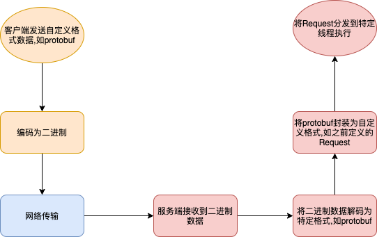

# 打造自己的通信框架四——NettyServer搭建

# 前言
从客户端发出一条消息到服务端接收并处理这条消息，大概可以分成下面的流程



黄色部分为客户端逻辑，蓝色为网络传输，红色为服务端逻辑，本文关注的是服务端逻辑。

# 正文

在Netty中，ChannelHandler充当了单元，ChannelPipeline充当处理链。处理链的构造如下

```java
        ChannelPipeline pipeline = ch.pipeline();
        //闲置链接监听
        pipeline.addLast(new IdleStateHandler(60, 60, 0));
        //闲置链接处理单元
        pipeline.addLast(idleEventHandler);
        //1 protobuf解码单元
        pipeline.addLast(new LengthFieldBasedFrameDecoder(1048576, 0, 4, 0, 4));
        pipeline.addLast(protobufDecoder);
        //2 protobuf封装为自定义协议Request单元
        pipeline.addLast(protobufRequestDecoder);
        //3 Request分发执行单元
        pipeline.addLast(requestDispatchHandler);
        //two protobuuf编码单元
        pipeline.addLast(new LengthFieldPrepender(4));
        pipeline.addLast(protobufEncoder);
        //one Response转换为protobuf单元
        pipeline.addLast(responseEncoder);
        // 异常处理单元
        pipeline.addLast(cleanupHandler);
```
标号1，2，3为我们需要关注的逻辑： **1.将二进制数据解码为protobuf -> 2.将protobuf编码为Request -> 3.Request分发执行**
在具体实现上对应下面三点
1. 从二进制数据转换为proto生成的Protocol
2. 从Protocol转换为Request的具体实现类(根据之前文章的定义,客户端发送的消息为Request)
3. 调用Request绑定的处理方法

下面我们详解这三个过程

### 将二进制数据解码为protobuf

在这一步我们将二进制数据转换成Protocol
这里使用的两个ChannelHandler都是Netty提供的，不过多叙述

* io.netty.handler.codec.LengthFieldBasedFrameDecoder
* io.netty.handler.codec.protobuf.ProtobufDecoder

### 将protobuf编码为Request

在这一步，`MessageFactory.toMessage(Protocol)`将Protocol转换为Request,传递给下一个处理单元
```java
@Component
@ChannelHandler.Sharable
public class ProtobufRequestDecoder extends MessageToMessageDecoder<Protocol> {


    @Override
    protected void decode(ChannelHandlerContext ctx, Protocol protocol,
                          List<Object> out) throws Exception {
        Request request = Context.getMessageFactory().toMessage(protocol);
        out.add(request);
    }
}
```

### Request分发执行

执行这一步之前,需要先了解Request包是如何跟方法关联起来的

#### Request和方法的绑定

采用类似于SpringMVC,固定处理方法的格式

> {sub_of_Response_or_void} method_name(Session session, {sub_of_Request} request);

举个例子`HelloResponse hello(Session session, HelloRequest request);`

#### 分发执行

这一步找出channel对应的Session,将其和Request一起提供给处理方法调用.

RequestMethodWrapper封装了处理方法,`session.execute(new JobExceptionLogProxy<>(new  RequestJob(wrapper, msg)));`将在之后的文章介绍

```java
@ChannelHandler.Sharable
public class RequestDispatchHandler extends SimpleChannelInboundHandler<Request> {

    @Override
    protected void channelRead0(ChannelHandlerContext ctx, Request msg) throws Exception {
        final int moduleId = msg.getHeader().getModuleId();
        final int commandId = msg.getHeader().getCommandId();
        RequestMethodWrapper  wrapper = Context.getMethodRegistry().getWrapper(moduleId,
                commandId);
        if (wrapper == null) {
            log.warn("no method wrapper for moduleId({}),commandId({})",
                    moduleId, commandId);
            return;
        }

        Optional<Session> optSession = Context.getSessionManager().getOrCreateSession(ctx.channel());
        if (optSession.isEmpty()) {
            return;
        }

        Session session = optSession.get();
        session.execute(new JobExceptionLogProxy<>(new  RequestJob(wrapper, msg)));
    }
}
```


# 后记
通过这套机制，打通了从消息接收到执行的逻辑.
