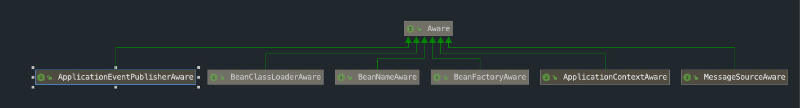

# ApplicationContext是如何被注入的

## 前言

```java
//ERROR No qualifying bean of type 'org.springframework.context.ApplicationContext' available
applicationContext.getBean(ApplicationContext.class);

//SUCCESS
@Component
public class SimpleBean3 {
    @Autowired
    private ApplicationContext applicationContext;  
    @Autowired
    private SimpleBean2 simpleBean2;
}
```
ApplicationContext是Spring中的重要组件,它不是bean,因此无法通过getBean获取它,但是可以通过Autowired注入获得,其中必定有特殊的处理,本文将简述ApplicationContext及类似的BeanFactory是如何实现注入逻辑的.最后稍微介绍一下Aware接口.

### TLDR

**普通Bean依赖Spring的容器功能进行注入,而ApplicationContext通过Spring的内建机制进行注入**.

* 普通Bean的元数据存放在DefaultListableBeanFactory的beanDefinitionNames和beanDefinitionMap,普通Bean通过遵照Spring提供的机制**自动注册添加**,这是Spring提供的功能
```java
private volatile List<String> beanDefinitionNames = new ArrayList<>(256);
private final Map<String, BeanDefinition> beanDefinitionMap = new ConcurrentHashMap<>(256);
```


* ApplicationContext和BeanFactory存储在DefaultListableBeanFactory的resolvableDependencies,它们需要**手动注册添加**,这是Spring的框架内部逻辑
```java
private final Map<Class<?>, Object> resolvableDependencies = new ConcurrentHashMap<>(16);
```

在**查找依赖时**,会同时搜寻beanDefinitionNames和resolvableDependencies,因此ApplicationContext也能被查找到.

而**getBean时**只会查找上面的BeanDefinitionMap,因此找不到ApplicationContext.

## 正文

### 注入流程

#### 注册ApplicationContext为resolvableDependencies

在AbstractApplicationContext.prepareBeanFactory()中,ApplicationContext被注册到resolvableDependencies中

```java
protected void prepareBeanFactory(ConfigurableListableBeanFactory beanFactory) {
		//...忽略部分代码
    
		// BeanFactory interface not registered as resolvable type in a plain factory.
		// MessageSource registered (and found for autowiring) as a bean.
		beanFactory.registerResolvableDependency(BeanFactory.class, beanFactory);
		beanFactory.registerResolvableDependency(ResourceLoader.class, this);
		beanFactory.registerResolvableDependency(ApplicationEventPublisher.class, this);
		beanFactory.registerResolvableDependency(ApplicationContext.class, this);
        //...忽略部分代码
	}
```

#### 生成Bean时查找依赖

创建SimpleBean3时,Spring检测到有applicationContext和simpleBean2两个依赖,便会进行查找.

在 [SpringBoot中@Autowired是如何生效的](https://alonwang.github.io/#/./article/Spring/SpringBoot中@Autowired是如何生效的?id=springboot中autowired是如何生效的)那篇文章中,讲到了带有@Autowired字段的在AutowiredAnnotationPostProcessor.postProcessProperties()中完成注入,查找依赖的入口就在`metadata.inject(bean, beanName, pvs)`

```java
	public PropertyValues postProcessProperties(PropertyValues pvs, Object bean, String beanName) {
		InjectionMetadata metadata = findAutowiringMetadata(beanName, bean.getClass(), pvs);
		try {
            //### 注入 ###
			metadata.inject(bean, beanName, pvs);
		}
		catch (BeanCreationException ex) {
			throw ex;
		}
		catch (Throwable ex) {
			throw new BeanCreationException(beanName, "Injection of autowired dependencies failed", ex);
		}
		return pvs;
	}
```

和注入相关的流程如下

> AutowiredAnnotationBeanPostProcesspr.postProcessProperties()
>
> =>InjectionMetadata.inject()
>
> ==>AutowiredFieldElement.inject()
>
> ===>DefaultListableBeanFactory.resolveDependency()
>
> ====>DefaultListableBeanFactory.doResolveDependency()
>
> =====>DefaultListableBeanFactory.findAutowireCandidates()


我们直接跳到DefaultListableBeanFactory.findAutowireCandidates(),可以看到是同时从BeanDefinitionNames和resolvableDependencies两个地方,因此可以找到ApplicationContext.

```java
	protected Map<String, Object> findAutowireCandidates(
			@Nullable String beanName, Class<?> requiredType, DependencyDescriptor descriptor) {
		String[] candidateNames = BeanFactoryUtils.beanNamesForTypeIncludingAncestors(
				this, requiredType, true, descriptor.isEager());
		Map<String, Object> result = new LinkedHashMap<>(candidateNames.length);
        //从resolvableDependencies中寻找
		for (Map.Entry<Class<?>, Object> classObjectEntry : this.resolvableDependencies.entrySet()) {
			//...
		}
        //从BeanDefinitionNames中寻找
		for (String candidate : candidateNames) {
			//...
		}
		return result;
	}
```

### Aware接口



Aware是一个标记接口,要求子接口需要提供一个回调setter方法.使用者可以在恰当的时机被回调,举个例子,实现了ApplicationContextAware的实例会在某个时间触发setApplicationContext获得applicationContext的实例.

```java
public interface ApplicationContextAware extends Aware {
	void setApplicationContext(ApplicationContext applicationContext) throws BeansException;

}
```

那么直接@Autowired注入和使用ApplicationContextAware注入有什么区别呢?

* **触发时机不同**,@Autowired方式会在InstantiationAwareBeanPostProcessor.postProcessProperties()阶段触发,ApplicationContextAware方式会在BeanPostProcessor.postProcessBeforeInitialization()阶段触发. **@Autowired方式早于ApplicationContextAware**
* ApplicationContextAware有更大的自由度,可以做更多自定义逻辑

## 后记

ApplicationContext不是bean,不能通过bean的方式进行注入,为了方面使用Spring通过特殊方式满足用户的注入需求,同时又提供了Aware系列接口,给与用户更大的自由度.