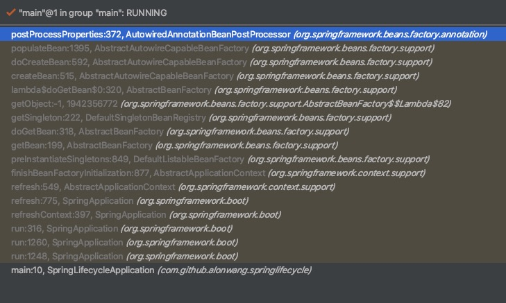

# SpringBoot中@Autowired是如何生效的

## 前言
```java
@Component
public class SimpleBean3 {
    @Autowired
    private SimpleBean simpleBean;
}
```
@Autowired修饰的字段会被容器自动注入.那么Spring Boot中使如何实现这一功能的呢? 

### **是它--AutowiredAnnotationBeanPostProcessor**

AutowiredAnnotationBeanPostProcessor(以下简称AutowiredProcessor)间接实现了**InstantiationAwareBeanPostProcessor**接口.通过postProcessProperties(...)完成@Autowired的注入

本文将按照Spring Boot的启动流程梳理出AutowiredProcessor的生效逻辑.


## 正文

### 注册AutowiredProcessor的BeanDefinition

**SpringApplication#createApplicationContext**默认会创建 **AnnotationConfigApplicationContext**,而AnnotationConfigApplicationContext又会创建**AnnotatedBeanDefinitionReader**

```java
	public AnnotationConfigApplicationContext() {
		this.reader = new AnnotatedBeanDefinitionReader(this);
		this.scanner = new ClassPathBeanDefinitionScanner(this);
	}
```

AnnotatedBeanDefinitionReader构造时会调用**AnnotationConfigUtils.registerAnnotationConfigProcessors(this.registry)**,将AutowiredProcessor的BeanDefinition注册到容器

```java
	public static Set<BeanDefinitionHolder> registerAnnotationConfigProcessors(
			BeanDefinitionRegistry registry, @Nullable Object source) {

		//忽略部分代码...

		if (!registry.containsBeanDefinition(AUTOWIRED_ANNOTATION_PROCESSOR_BEAN_NAME)) {
			RootBeanDefinition def = new RootBeanDefinition(AutowiredAnnotationBeanPostProcessor.class);
			def.setSource(source);
			beanDefs.add(registerPostProcessor(registry, def, AUTOWIRED_ANNOTATION_PROCESSOR_BEAN_NAME));
		}

		//忽略部分代码...

		return beanDefs;
	}
```

### 实例化AutowiredProcessor

在AbstractApplicationContext的refresh阶段,会注册并实例化所有的BeanPostProcessor

```java
public void refresh() throws BeansException, IllegalStateException {
		    //...忽略部分代码
  
				// Allows post-processing of the bean factory in context subclasses.
				postProcessBeanFactory(beanFactory);

				// Invoke factory processors registered as beans in the context.
				invokeBeanFactoryPostProcessors(beanFactory);
				
				// ########### 这里注册所有的BeanPostProcessor ##########  
				// Register bean processors that intercept bean creation.
				registerBeanPostProcessors(beanFactory);

				// Initialize message source for this context.
				initMessageSource();

				// Initialize event multicaster for this context.
				initApplicationEventMulticaster();

				// Initialize other special beans in specific context subclasses.
				onRefresh();

				// Check for listener beans and register them.
				registerListeners();

				// Instantiate all remaining (non-lazy-init) singletons.
				finishBeanFactoryInitialization(beanFactory);

				// Last step: publish corresponding event.
				finishRefresh()

			//...忽略部分代码
	}
```

实际的注册逻辑交给了PostProcessorRegistrationDelegate

```java
	protected void registerBeanPostProcessors(ConfigurableListableBeanFactory beanFactory) {
		PostProcessorRegistrationDelegate.registerBeanPostProcessors(beanFactory, this);
	}
```

在PostProcessorRegistrationDelegate中,获取到所有的BeanPostProcessor(基于BeanDefinition),并将其分为几种类型,并按照不同的优先级进行处理化,这块不是这篇文章的重点,我们只需要知道**在这里AutowiredProcessor被注册**就可以了.

### 创建bean时进行注入

以SimpleBean3的注入为例, 它是单例的,在AbstractApplicationContext.refresh()的**finishBeanFactoryInitialization(beanFactory)**时创建.

```java
	protected void finishBeanFactoryInitialization(ConfigurableListableBeanFactory beanFactory) {
		//...忽略部分代码

		// Instantiate all remaining (non-lazy-init) singletons.
		beanFactory.preInstantiateSingletons();
	}
```

调用到了BeanFactory.preInstantiateSingletons(),走到getBean()逻辑

```java
public void preInstantiateSingletons() throws BeansException {
		//...忽略部分代码
  
		List<String> beanNames = new ArrayList<>(this.beanDefinitionNames);
		// Trigger initialization of all non-lazy singleton beans...
		for (String beanName : beanNames) {
			RootBeanDefinition bd = getMergedLocalBeanDefinition(beanName);
			if (!bd.isAbstract() && bd.isSingleton() && !bd.isLazyInit()) {
				if (isFactoryBean(beanName)) {
					Object bean = getBean(FACTORY_BEAN_PREFIX + beanName);
					if (bean instanceof FactoryBean) {
						final FactoryBean<?> factory = (FactoryBean<?>) bean;
						boolean isEagerInit;
						if (System.getSecurityManager() != null && factory instanceof SmartFactoryBean) {
							isEagerInit = AccessController.doPrivileged((PrivilegedAction<Boolean>)
											((SmartFactoryBean<?>) factory)::isEagerInit,
									getAccessControlContext());
						}
						else {
							isEagerInit = (factory instanceof SmartFactoryBean &&
									((SmartFactoryBean<?>) factory).isEagerInit());
						}
						if (isEagerInit) {
							getBean(beanName);
						}
					}
				}
				else {
					getBean(beanName);
				}
			}
		}

		//...忽略部分代码
	}
```

经过一连串的辗转,最终调用到**AbstractAutowireCapableBeanFactory#populateBean**

附上调用链路



在populateBean中,会将所有的BeanPostProcessor应用在这个bean上,包括AutowiredProcessor
```java
protected void populateBean(String beanName, RootBeanDefinition mbd, @Nullable BeanWrapper bw) {
		//...忽略部分代码
		PropertyDescriptor[] filteredPds = null;
		if (hasInstAwareBpps) {
			if (pvs == null) {
				pvs = mbd.getPropertyValues();
			}
			for (BeanPostProcessor bp : getBeanPostProcessors()) {
				if (bp instanceof InstantiationAwareBeanPostProcessor) {
					InstantiationAwareBeanPostProcessor ibp = (InstantiationAwareBeanPostProcessor) bp;
          //###### 调用到postProcessProperties #####
					PropertyValues pvsToUse = ibp.postProcessProperties(pvs, bw.getWrappedInstance(), beanName);
					if (pvsToUse == null) {
						if (filteredPds == null) {
							filteredPds = filterPropertyDescriptorsForDependencyCheck(bw, mbd.allowCaching);
						}
						pvsToUse = ibp.postProcessPropertyValues(pvs, filteredPds, bw.getWrappedInstance(), beanName);
						if (pvsToUse == null) {
							return;
						}
					}
					pvs = pvsToUse;
				}
			}
		}
	//...忽略部分代码
	}
```

AutowiredProcessor的postProcessProperties()会进行注入操作,这需要找到注入的元数据(InjectionMetadata)

```java
public PropertyValues postProcessProperties(PropertyValues pvs, Object bean, String beanName) {		
		//### 找到AutowringMetadata #####
		InjectionMetadata metadata = findAutowiringMetadata(beanName, bean.getClass(), pvs);
		try {
      // #### 注入 ###
			metadata.inject(bean, beanName, pvs);
		}
		catch (BeanCreationException ex) {
			throw ex;
		}
		catch (Throwable ex) {
			throw new BeanCreationException(beanName, "Injection of autowired dependencies failed", ex);
		}
		return pvs;
	}
```

findAutowiringMetadata()又调用到buildAutowiringMetadata(),生成代表可注入元素的InjectMetadata

```java
private InjectionMetadata buildAutowiringMetadata(final Class<?> clazz) {
		List<InjectionMetadata.InjectedElement> elements = new ArrayList<>();
		Class<?> targetClass = clazz;

		do {
			final List<InjectionMetadata.InjectedElement> currElements = new ArrayList<>();

			ReflectionUtils.doWithLocalFields(targetClass, field -> {
        //###### 找到带有可注入注解的字段
				AnnotationAttributes ann = findAutowiredAnnotation(field);
				if (ann != null) {
					if (Modifier.isStatic(field.getModifiers())) {
						if (logger.isInfoEnabled()) {
							logger.info("Autowired annotation is not supported on static fields: " + field);
						}
						return;
					}
					boolean required = determineRequiredStatus(ann);
					currElements.add(new AutowiredFieldElement(field, required));
				}
			});

			//...忽略部分代码
	}

```

findAutowiredAnnotation()根据AutowiredProcessor的实例字段autowiredAnnotationTypes,去查看是否匹配,这个字段是在AutowiredProcessor创建时初始化,可以看到支持**@Autowired,@Value,@Inject**三种类型的注入标识.

```java
public AutowiredAnnotationBeanPostProcessor() {
		this.autowiredAnnotationTypes.add(Autowired.class);
		this.autowiredAnnotationTypes.add(Value.class);
		try {
			this.autowiredAnnotationTypes.add((Class<? extends Annotation>)
					ClassUtils.forName("javax.inject.Inject", AutowiredAnnotationBeanPostProcessor.class.getClassLoader()));
			logger.trace("JSR-330 'javax.inject.Inject' annotation found and supported for autowiring");
		}
		catch (ClassNotFoundException ex) {
			// JSR-330 API not available - simply skip.
		}
	}
```

Bean注入这块比较乱,让我们梳理一下

>  =>提前初始化所有单例bean(preInstantiateSingletons())
>
> ​	 => 获取bean getBean()
>
> ​		=> 创建bean doCreateBean()
>
> ​			=>生成bean populateBean()
>
> ​				=> 应用AutowiredProcessor ibp.postProcessProperties()
>
> ​						=>  找到可注入的字段(buildAutowiringMetadata)
>
> ​							=> 注入(metadata.inject)

## 后记

至此,@Autowired的生效逻辑整理完毕

