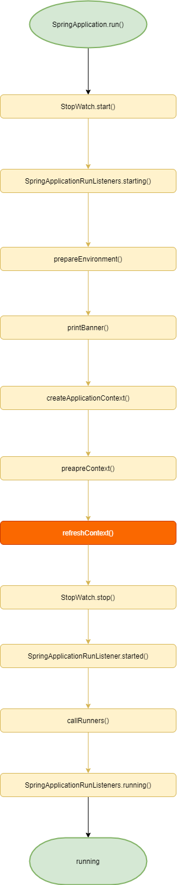
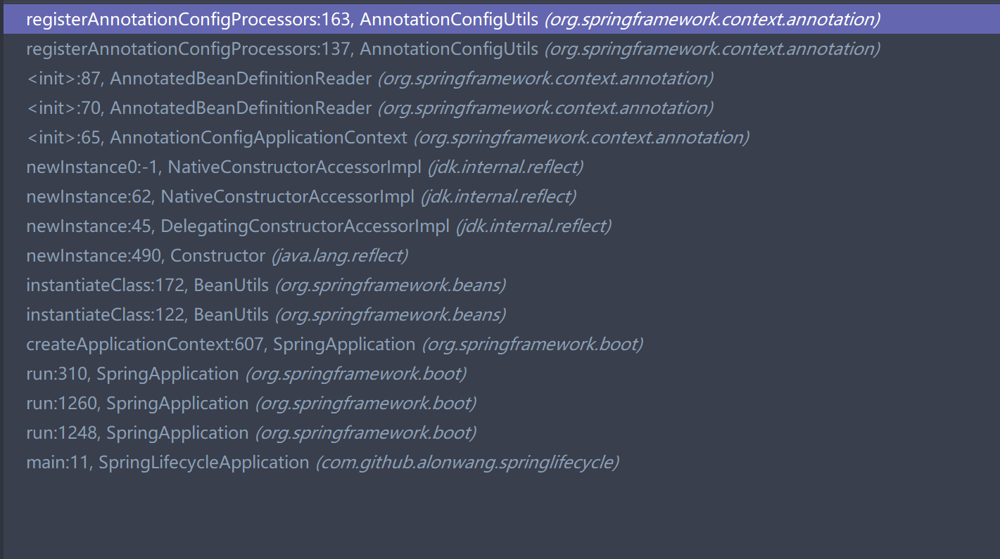
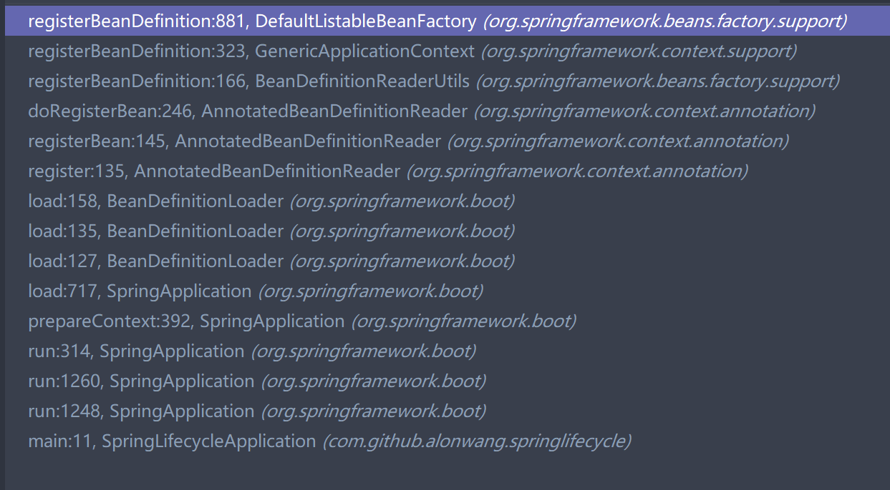
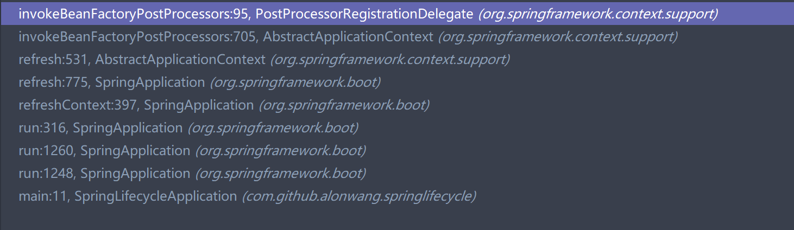
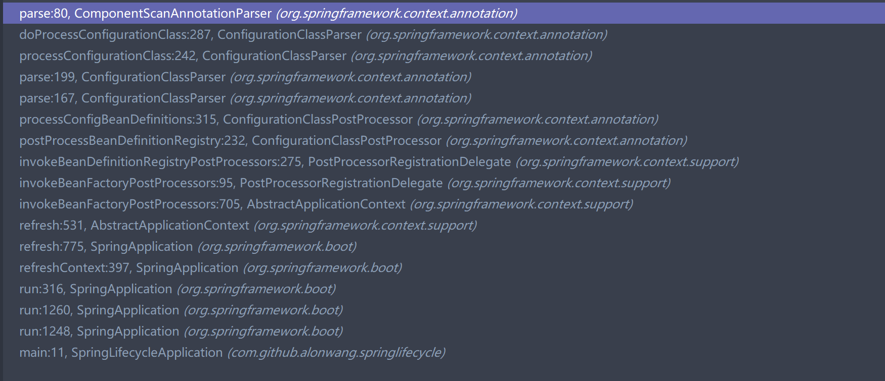
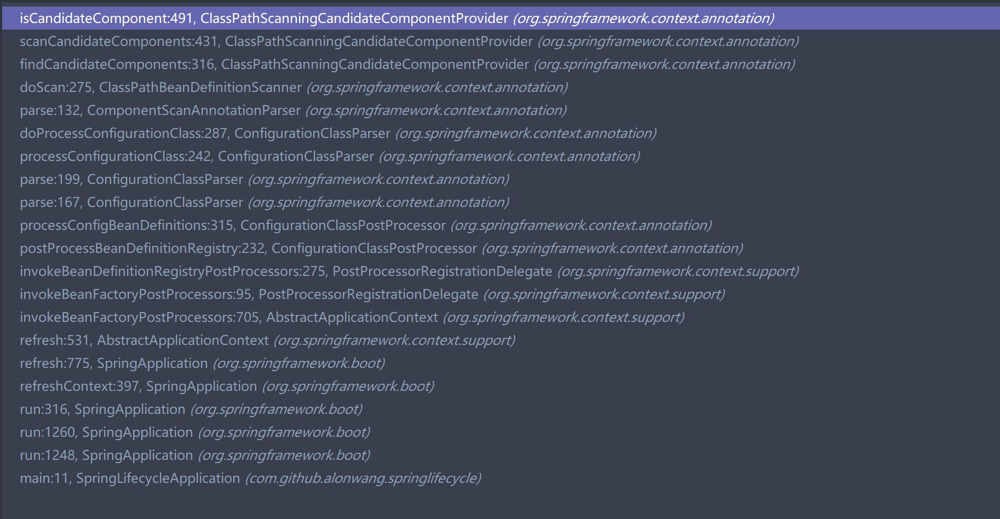

# SpringBoot中@Component是如何生效的

## 前言

在SpringBoot中,只需要一个简单的启动类,就能自动完成很多复杂的工作, 其中就有自动扫描classpath,将带有@Component的类生成bean.

```java
@SpringBootApplication
public class SpringLifecycleApplication {

    public static void main(String[] args) {
        ApplicationContext applicationContext = SpringApplication.run(SpringLifecycleApplication.class, args);
    }

}
//自动注册为bean
@Component
public class SimpleBean{
    
}
```

本文将探究SpringBoot中@Component的生效逻辑.

## 正文

### @SpringBootApplication简介

@SpringBootApplication注解是SpringBoot的关键,它组合了@Configuration,@ComponentScan等注解,有必要提前了解一下,源码如下

```java
@Target(ElementType.TYPE)
@Retention(RetentionPolicy.RUNTIME)
@Documented
@Inherited
@SpringBootConfiguration
@EnableAutoConfiguration
@ComponentScan(excludeFilters = {
		@Filter(type = FilterType.CUSTOM, classes = TypeExcludeFilter.class),
		@Filter(type = FilterType.CUSTOM, classes = AutoConfigurationExcludeFilter.class) })
public @interface SpringBootApplication {

	@AliasFor(annotation = EnableAutoConfiguration.class)
	Class<?>[] exclude() default {};

	@AliasFor(annotation = EnableAutoConfiguration.class)
	String[] excludeName() default {};

	@AliasFor(annotation = ComponentScan.class, attribute = "basePackages")
	String[] scanBasePackages() default {};

	@AliasFor(annotation = ComponentScan.class, attribute = "basePackageClasses")
	Class<?>[] scanBasePackageClasses() default {};

}
```
这里要提一下,**Spring对注解的处理通常是递归的**,例如查找SpringLifecycleApplication这个类是否被@Configuration注解,会经历以下几步

> 查找SpringLifecycleApplication的注解, 找到`@SpringBootApplication`,不是需要的`@Configuration`,继续
>
> 查找修饰`@SpringBootApplication`的注解, 找到`@SpringBootConfiguration`,`@ComponentScan`等注解
>
> 还是没有符合的,再查看修饰这些注解的注解~ 如此递归查找,在@SpringBootConfiguration中找到`@Configuration`,成功

类似的还有@`Service`,`@Controller`.它们都被`@Component`修饰,因此查找包含`@Component`注解的类时它们也是符合的.

### @Component的生效逻辑

下面将按照SpringBoot的启动流程讲解@Component,参见下图




### 1. createApplicationContext阶段: 注册ConfigurationClassPostProcessor

SpringBoot默认创建`AnnotationConfigApplicationContext`,它在构造时会创建`AnnotatedBeanDefinitionReader`,后者构造时会调用`AnnotationConfigUtils.registerAnnotationConfigProcessors()`注册`ConfigurationClassPostProcessor`的BeanDefinition.

ConfigurationClassPostProcessor会处理带@Configuartion修饰的bean,下面会用到




### 2. prepareContext阶段: 注册启动类SpringLifeCycleApplication的BeanDefinition

在Spring启动的早期阶段,就会将SpringLifeCycleApplication注册为bean,后续的很多逻辑都会根据它身上的@SpringBootApplication(以及其他注解)去做



### 3. refreshContext阶段的invokeBeanFactoryPostProcessor(): 调用ConfigurationClassPostProcessor.postProcessBeanDefinitionRegistry()




插一段,先来理一下invokeBeanFactoryPostProcessor()的具体逻辑,分为两块: postProcessBeanDefinitionRegistry()和postProcessBeanFactory()

* postProcessBeanDefinitionRegistry()允许**添加自定义的BeanDefinition**(对于通过xml注册的BeanDefinition或代码注册的称之为正常,其他的如通过注解@Component添加的都称为自定义),**经过这一步,Spring不再允许添加BeanDefinition**,由于新注册的BeanDefinition可能代表一个BeanFactoryPostProcessor,因此这个过程是迭代进行的,具体逻辑是:

  > 执行所有BeanFactoryPostProcessor,如果执行后有新的BeanFactoryPostProcessor生成,执行它们,循环进行直到没有新的BeanFactoryPostProcessor生成
  
* postProcessBeanFactory()**允许对现有的BeanDefinition做修改**,这个是一次性全部调用

这里有一个涉及到bean生命周期的问题, 如果一个BeanFactoryPostProcessor通过@Autowired依赖其他bean,  会生效吗?

```java
@Component
public class SimpleBeanFactoryPostProcessor implements BeanDefinitionRegistryPostProcessor {
    @Autowired
    private SimpleBean simpleBean;
}
```

**不会**,BeanFactoryPostProcessor初始化时还没有 BeanpostProcessor,而@Autowired又是依赖AutowiredAnnotationBeanPostProcessor进行注入,这就导致BeanFactoryPostProcessor中的依赖不会被注入,simpleBean一直为null

回归正文,这一步生成并调用前面注册的ConfigurationClassPostProcessor,它逻辑是: **查找现有的BeanDefinition(是包含SpringLifecycleApplication的BeanDefinition),对带有@Configuration注解的,使用`ConfigurationClassParser`进行解析处理**,判断是否为满足@Configuration注解要求的逻辑如下

```java
	public static boolean isFullConfigurationCandidate(AnnotationMetadata metadata) {
		return metadata.isAnnotated(Configuration.class.getName());
	}
	//StandardAnnotationMetadata
	public boolean isAnnotated(String annotationName) {
		return (this.annotations.length > 0 &&
				AnnotatedElementUtils.isAnnotated(getIntrospectedClass(), annotationName));
	}
	//这个方法会递归寻找注解. 如SpringLifeCycleApplication只有注解@SpringBootApplication,没找到@Configuration
	//就会去寻找@SpringBootApplication这个注解包含的注解,按此规律递归寻找直至找到或者递归终止,对于@SpringBootApplication  
    //它拥有的注解@SpringBootConfiguration拥有@Configuration注解,因此最终是符合条件的
	public static boolean isAnnotated(AnnotatedElement element, String annotationName) {
		return Boolean.TRUE.equals(searchWithGetSemantics(element, null, annotationName, alwaysTrueAnnotationProcessor));
	}
```

### 4. ConfigurationClassParser解析启动类,获取@ComponScan注解,将解析工作委托给ComponentScanAnnotationParser

由于@SpringBootApplication是被@ComponentScan注解的,这块逻辑会解析到.实际的处理操作会委托给ComponentScanAnnotationParser,由它扫描BeanDefinition

```java
		// Process any @ComponentScan annotations
		Set<AnnotationAttributes> componentScans = AnnotationConfigUtils.attributesForRepeatable(
				sourceClass.getMetadata(), ComponentScans.class, ComponentScan.class);
		if (!componentScans.isEmpty() &&
				!this.conditionEvaluator.shouldSkip(sourceClass.getMetadata(), ConfigurationPhase.REGISTER_BEAN)) {
			for (AnnotationAttributes componentScan : componentScans) {
                  // ### 扫描生成一些新的BeanDefinition ### 	
				// The config class is annotated with @ComponentScan -> perform the scan immediately
				Set<BeanDefinitionHolder> scannedBeanDefinitions =
						this.componentScanParser.parse(componentScan, sourceClass.getMetadata().getClassName());
				// Check the set of scanned definitions for any further config classes and parse recursively if needed
				for (BeanDefinitionHolder holder : scannedBeanDefinitions) {
					BeanDefinition bdCand = holder.getBeanDefinition().getOriginatingBeanDefinition();
					if (bdCand == null) {
						bdCand = holder.getBeanDefinition();
					}
					if (ConfigurationClassUtils.checkConfigurationClassCandidate(bdCand, this.metadataReaderFactory)) {
						parse(bdCand.getBeanClassName(), holder.getBeanName());
					}
				}
			}
		}
```

### 5. ComponentScanAnnotationParser解析@ComponentScan的属性,获取到BasePackage再使用ClassPathBeanDefinitionScanner进行扫描

这里主要解析出BasePackage,然后将工作委托给ClassPathBeanDefinitionScanner,默认BasePackage就是被@SpringBootApplication注解的这个类所在的包位置,我们这里就是`com.github.alonwang.springlifecycle`



### 6. ClassPathBeanDefinitionScanner扫描BasePackage路径,获取到符合条件的Bean


这里会扫描BasePackage下的所有class,将所有符合条件的class封装起来,注册到容器中
```java
protected Set<BeanDefinitionHolder> doScan(String... basePackages) {
		Assert.notEmpty(basePackages, "At least one base package must be specified");
		Set<BeanDefinitionHolder> beanDefinitions = new LinkedHashSet<>();
		for (String basePackage : basePackages) {
             //找到包下所有符合条件的类,生成其BeanDefinition
			Set<BeanDefinition> candidates = findCandidateComponents(basePackage);
			for (BeanDefinition candidate : candidates) {
				//...
				if (checkCandidate(beanName, candidate)) {
					BeanDefinitionHolder definitionHolder = new BeanDefinitionHolder(candidate, beanName);
					definitionHolder =
							AnnotationConfigUtils.applyScopedProxyMode(scopeMetadata, definitionHolder, this.registry);
					beanDefinitions.add(definitionHolder);
                      // 注册到容器中
					registerBeanDefinition(definitionHolder, this.registry);
				}
			}
		}
		return beanDefinitions;
	}
```

这里的条件由excludeFilters和includeFilters共同限定,默认includeFilter在构造ClassPathBeanDefinitionScanner时添加,包含@Component的AnnotationTypeFilter. 它也遵循Spring注解递归查找的原则, 因为@Controller,@Service也是被@Component注解修饰的,因此他们也能被扫描到

```java
	protected boolean isCandidateComponent(MetadataReader metadataReader) throws IOException {
		for (TypeFilter tf : this.excludeFilters) {
			if (tf.match(metadataReader, getMetadataReaderFactory())) {
				return false;
			}
		}
		for (TypeFilter tf : this.includeFilters) {
			if (tf.match(metadataReader, getMetadataReaderFactory())) {
				return isConditionMatch(metadataReader);
			}
		}
		return false;
	}
```

至此@Component生效逻辑讲解完毕.


