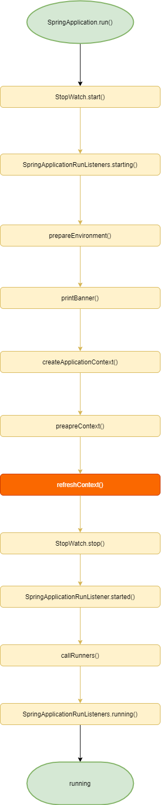
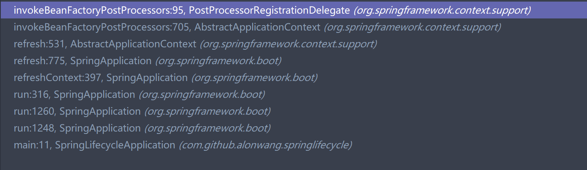
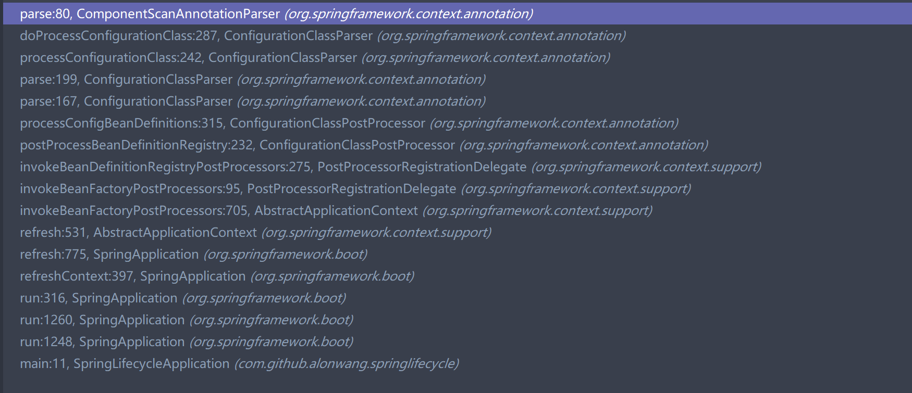
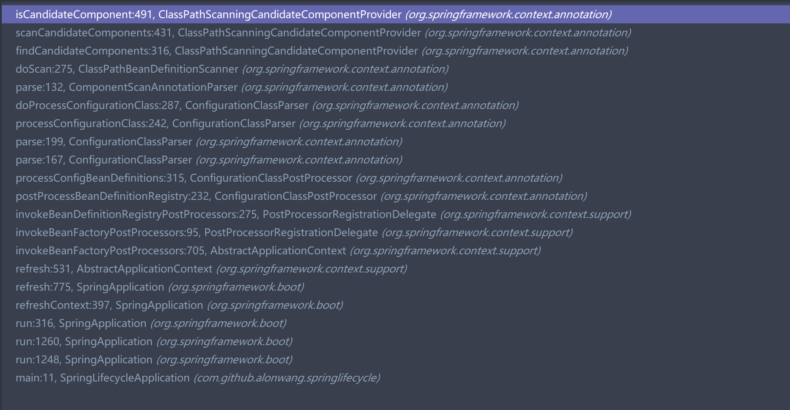

# SpringBoot中Bean是如何被扫描到的?

## 前言

在SpringBoot中,只需要一个简单的启动类,就能自动完成很多复杂的工作, 包括bean的扫描.本文将探究SpringBoot如何扫描添加Bean.

```java
@SpringBootApplication
public class SpringLifecycleApplication {

    public static void main(String[] args) {
        ApplicationContext applicationContext = SpringApplication.run(SpringLifecycleApplication.class, args);
    }

}
```

## 正文



### 1. createApplicationContext阶段: 注册ConfigurationClassPostProcessor
SpringBoot默认创建`AnnotationConfigApplicationContext`,它在构造时会创建`AnnotatedBeanDefinitionReader`,后者构造时会调用`AnnotationConfigUtils.registerAnnotationConfigProcessors()`注册`ConfigurationClassPostProcessor`的BeanDefinition.


### 2. prepareContext阶段: 注册启动类SpringLifeCycleApplication的BeanDefinition

在Spring启动的早期阶段,就会将SpringLifeCycleApplication注册上去,后续的很多逻辑都会根据它身上的@SpringBootApplication(以及其他注解)去做


### 3. refreshContext阶段的invokeBeanFactoryPostProcessor(): 调用ConfigurationClassPostProcessor.postProcessBeanDefinitionRegistry()




这一阶段进行BeanFactory前置处理,这又分为两块: postProcessBeanDefinitionRegistry()和postProcessBeanFactory()

* postProcessBeanDefinitionRegistry()是对BeanDefinitionRegistery操作,**现有的BeanFactoryPostProcessor可能会注册其他的BeanDefinition,而其他的BeanDefinition可能对应一个新的BeanFactoryPostProcessor,因此这一步是循环进行的**(这也是我们自定义的BeanFactoryPostProcessor能生效的原因)

  ```java
  1. 获取所有BeanFactoryPostProcessor的BeanDefinition,如果为空,结束
  2. 对某个BeanFactoryPostProcessor,如果还未执行过,执行
  ```
* postProcessBeanFactory()运行时,BeanFactoryPostProcessor已经固定,一次性全部调用


对ConfigurationClassPostProcessor,它逻辑是: **查找现有的BeanDefinition(包含SpringLifecycleApplication的BeanDefinition),对带有@Configuration注解的,使用`ConfigurationClassParser`进行解析处理**

判断是否为满足@Configuration注解要求的逻辑如下

```java
	public static boolean isFullConfigurationCandidate(AnnotationMetadata metadata) {
		return metadata.isAnnotated(Configuration.class.getName());
	}
	//StandardAnnotationMetadata
	public boolean isAnnotated(String annotationName) {
		return (this.annotations.length > 0 &&
				AnnotatedElementUtils.isAnnotated(getIntrospectedClass(), annotationName));
	}
	//这个方法会递归寻找注解. 如SpringLifeCycleApplication只有注解@SpringBootApplication,没找到@Configuration
	//就会去寻找@SpringBootApplication这个注解包含的注解,按此规律递归寻找直至找到或者递归终止,对于@SpringBootApplication  
    //它拥有的注解@SpringBootConfiguration拥有@Configuration注解,因此最终是符合条件的
	public static boolean isAnnotated(AnnotatedElement element, String annotationName) {
		return Boolean.TRUE.equals(searchWithGetSemantics(element, null, annotationName, alwaysTrueAnnotationProcessor));
	}
```

### 4. ConfigurationClassParser对@ComponentScan调用ComponentScanAnnotationParser进行处理

ConfigurationClassParser中的这段逻辑,会调用ComponentScanAnnotationParser解析@ComponentScan,由于@SpringBootApplication是被@ComponentScan注解的,因此这里会解析到

```java
		// Process any @ComponentScan annotations
		Set<AnnotationAttributes> componentScans = AnnotationConfigUtils.attributesForRepeatable(
				sourceClass.getMetadata(), ComponentScans.class, ComponentScan.class);
		if (!componentScans.isEmpty() &&
				!this.conditionEvaluator.shouldSkip(sourceClass.getMetadata(), ConfigurationPhase.REGISTER_BEAN)) {
			for (AnnotationAttributes componentScan : componentScans) {
                  // ### 扫描生成一些新的BeanDefinition ### 	
				// The config class is annotated with @ComponentScan -> perform the scan immediately
				Set<BeanDefinitionHolder> scannedBeanDefinitions =
						this.componentScanParser.parse(componentScan, sourceClass.getMetadata().getClassName());
				// Check the set of scanned definitions for any further config classes and parse recursively if needed
				for (BeanDefinitionHolder holder : scannedBeanDefinitions) {
					BeanDefinition bdCand = holder.getBeanDefinition().getOriginatingBeanDefinition();
					if (bdCand == null) {
						bdCand = holder.getBeanDefinition();
					}
					if (ConfigurationClassUtils.checkConfigurationClassCandidate(bdCand, this.metadataReaderFactory)) {
						parse(bdCand.getBeanClassName(), holder.getBeanName());
					}
				}
			}
		}
```

### 5. ComponentScanAnnotationParser解析@ComponentScan的属性,获取到BasePackage再使用ClassPathBeanDefinitionScanner进行扫描

默认BasePackage就是被@SpringBootApplication注解的这个类所在的包位置,我们这里就是`com.github.alonwang.springlifecycle`



### 6. ClassPathBeanDefinitionScanner扫描BasePackage路径,获取到符合条件的Bean

这里的条件由excludeFilters和includeFilters共同限定,默认includeFilter在构造ClassPathBeanDefinitionScanner扫描BasePackage路径时添加,包含@Component的AnnotationTypeFilter. 它也遵循递归查找的原则, 由于@Controller,@Service也是被@Component注解的,因此他们也能被扫描到
```
	protected boolean isCandidateComponent(MetadataReader metadataReader) throws IOException {
		for (TypeFilter tf : this.excludeFilters) {
			if (tf.match(metadataReader, getMetadataReaderFactory())) {
				return false;
			}
		}
		for (TypeFilter tf : this.includeFilters) {
			if (tf.match(metadataReader, getMetadataReaderFactory())) {
				return isConditionMatch(metadataReader);
			}
		}
		return false;
	}
```


## 后记
### 一个可能的迷惑点
如果一个BeanFactoryPostProcessor通过@Autowired依赖其他bean,  会生效吗?
```java
@Component
public class SimpleBeanFactoryPostProcessor implements BeanDefinitionRegistryPostProcessor {
    @Autowired
    private SimpleBean simpleBean;
}
```
**不会**,BeanFactoryPostProcessor初始化时还没有 BeanpostProcessor,而@Autowired又是依赖AutowiredAnnotationBeanPostProcessor进行注入,这就导致BeanFactoryPostProcessor中的依赖不会被注入,simpleBean一直为null

那么同样的逻辑放到BeanPostProcessor上会生效吗?
**会**对BeanPostProcessor,由于用户注册的BeanPostProcessor一定在AutowiredAnnotationBeanPostProcessor之后,依赖是可以注入的,simpleBean会被正常注入


