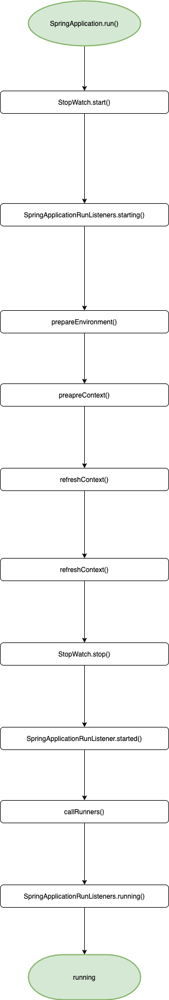

# Spring Boot启动流程简介

> Spring Boot makes it easy to create stand-alone, production-grade Spring based Applications that you can "just run".


```java
@SpringBootApplication
public class SpringLifecycleApplication {

    public static void main(String[] args) {
        SpringApplication.run(SpringLifecycleApplication.class, args);
    }

}
```

SpringApplication的启动十分简单,仅需上面几行代码,比直接使用Spring Framework简单的多,这也意味着其内部隐藏着复杂的逻辑,我准备做一个系列讲解Spring Boot的启动流程,作为开篇,以下面这张图简要描绘SpringApplication的启动过程

