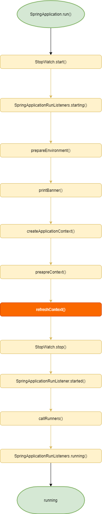

# Spring Boot启动流程

## 前言

> Spring Boot makes it easy to create stand-alone, production-grade Spring based Applications that you can "just run".

Spring Boot使得创建Spring应用十分简单,

```java
@SpringBootApplication
public class SpringLifecycleApplication {

    public static void main(String[] args) {
        SpringApplication.run(SpringLifecycleApplication.class, args);
    }

}
```


