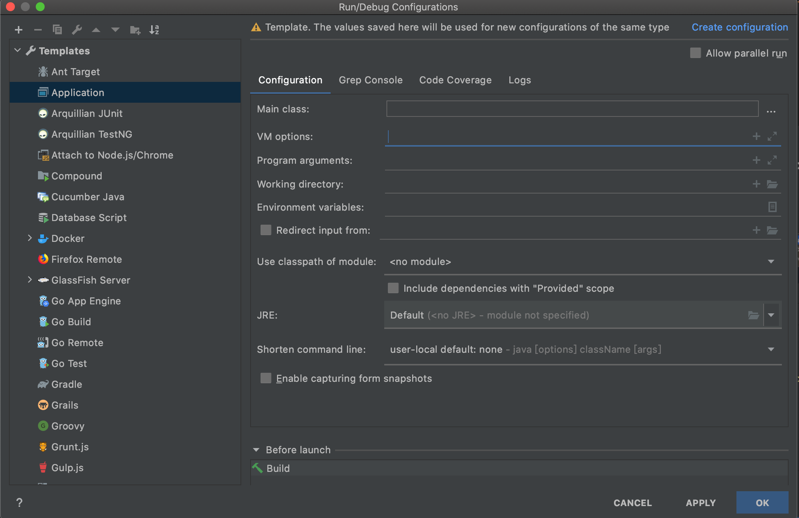
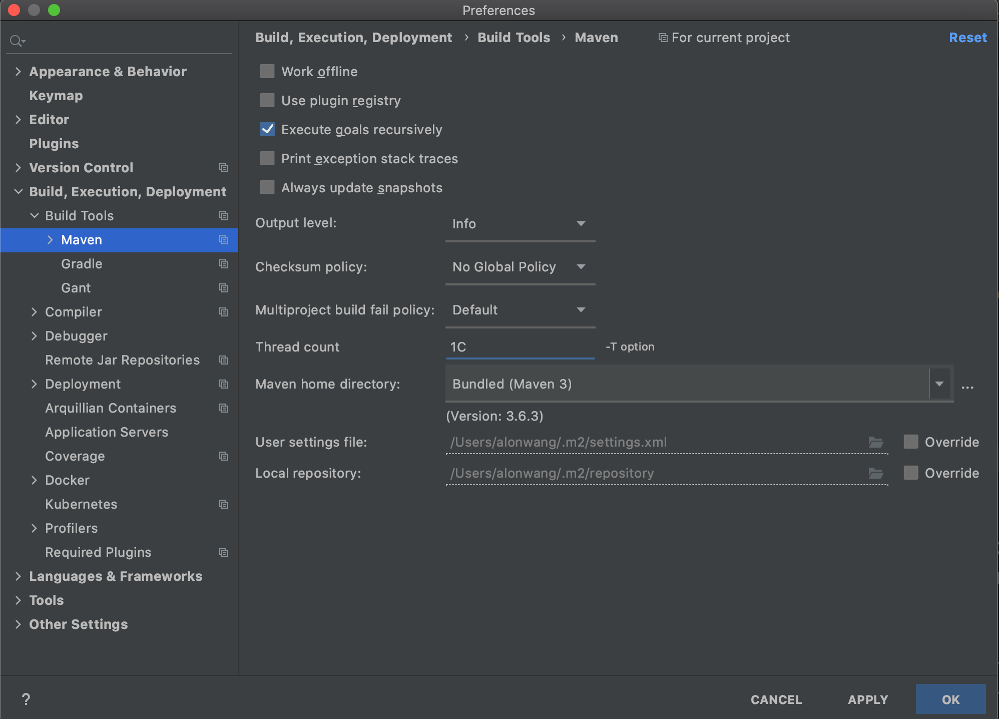
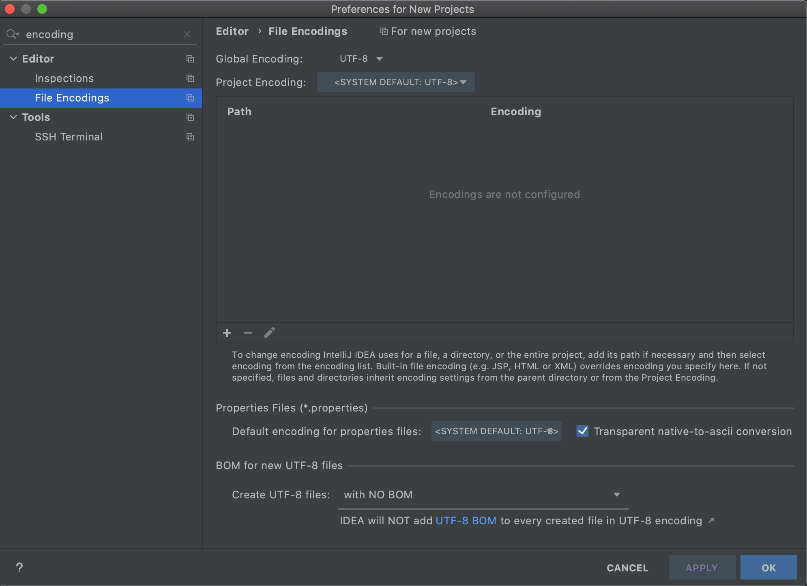
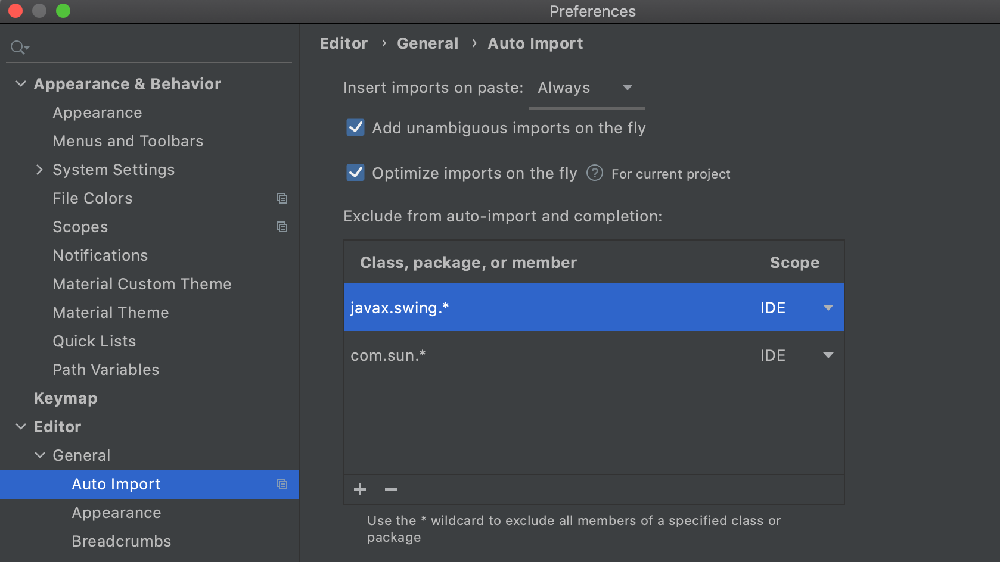
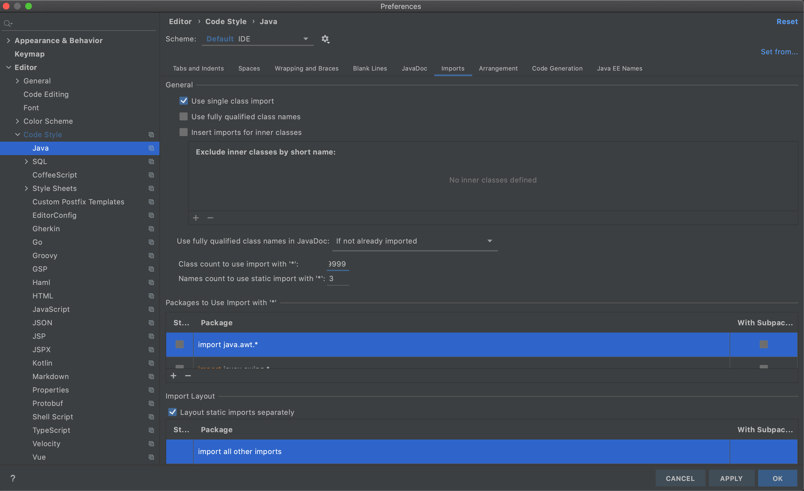
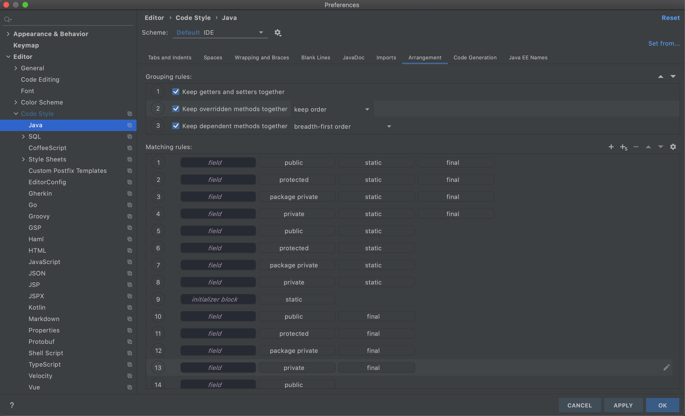
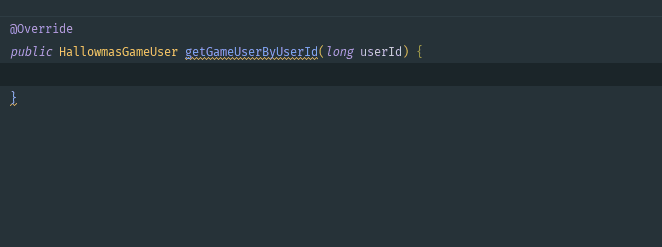
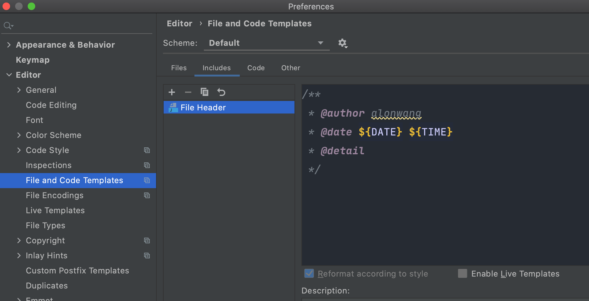

### Run/Debug Configurations添加JVM启动参数


推荐网站http://jvmmemory.com/



在VM options添加

```properties
# 不同版本JVM支持命令可能发生变化,详见 https://www.oracle.com/java/technologies/javase/vmoptions-jsp.html

# 打印命令行参数 推荐添加
-XX:+PrintCommandLineFlags
# 打印Flag参数 推荐添加
-XX:+PrintFlagsFinal

# 发生OOM时，自动生成DUMP文件  推荐添加
-XX:+HeapDumpOnOutOfMemoryError
# 生成DUMP文件路径,支持相对路径,默认生成文件名 java_pid{pid}.hprof
-XX:HeapDumpPath=./dump
# 禁止调用System.gc()的显式GC
-XX:+DisableExplicitGC

# 开启GC日志打印 按需添加
-verbose:gc
# GC日志位置
-Xlog:gc:./gc.log


```


### maven

#### 开启并行编译

Thread count 添加1C

#### settings.xml和repository配置

强烈建议使用默认的User settings file 和Local repository,避免出现IDE和命令行执行不一致.(*这里被坑过很多次,血泪教训*)




### 编码

* 全局改为UTF-8编码(无BOM).再也不用担心乱码问题

* 开启 Transparent native-to-ascii conversion功能, IDE会自动将ASCII编码数据转换为UTF-8展示.详见[IDEA中properties文件的 Transparent native-to-ascii 功能探究](https://www.jianshu.com/p/8409237e0114) 



### 修改IDEA properties

>  Help => Edit Custom Properties 

修改IDEA的一些配置,配置项参见[官方文档](https://www.jetbrains.com/help/idea/tuning-the-ide.html#common-platform-properties)

```properties
# 强制IDEA对大文件进行代码分析
idea.max.intellisense.filesize=99999
```

### 修改IDEA VM Options

> Help => Edit Custom VM Options

IDEA也是一个JAVA项目,可以配置其JVM启动参数以获得更好体验

```properties
# 加载字节码时,不进行验证. 在这个场景下,可以减少不必要的性能损耗
-Xverify:none
```


### 导包

> Editor => General => Auto Import

开启自动导包和导包优化. 并将一些不常用但容易冲突的包排除在外




### Code Style

调整 Class count to use import with '*' 改为99999, 间接禁用 import *



代码排列(rearrange),勾选 Grouping rules, 个人项目我一般都会勾上.团队项目就不要用了.




### live template

放个效果图,这个比较复杂,具体使用参见我的另一篇文章[idea中live template的详细使用教程](https://www.jianshu.com/p/3974df6572af)



### file and code template

给你的新建文件添加作者时间等信息,这里还可以使用Apache Velocity引擎进行更高级的操作,详见[idea中file template的较高级使用](https://www.jianshu.com/p/189ce7ea7ba6)

